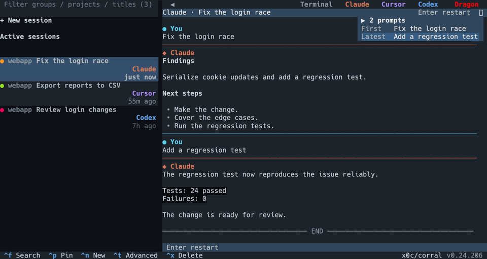
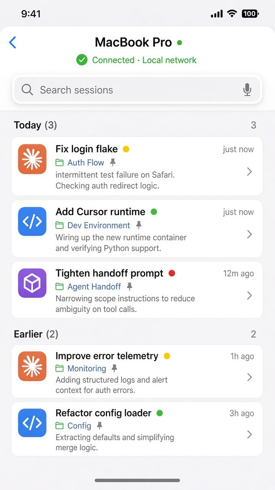
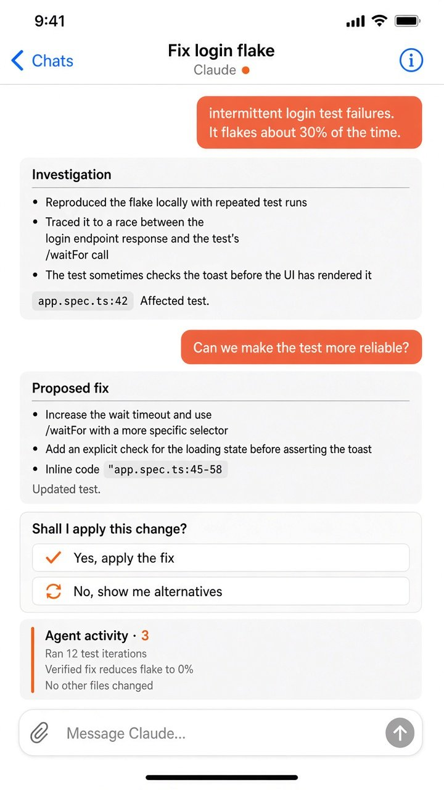

**Languages:** English | [简体中文](README.zh-CN.md)

<p align="center">
  
</p>
<h1 align="center">Corral</h1>
<p align="center"><strong>Find yesterday's lost chat. One list of coding-agent sessions.</strong></p>
<p align="center">Search Claude Code, Codex, Cursor, OpenCode, Kimi Code, and Pi conversation history — then resume work in one session manager.</p>

<p align="center">
  <a href="https://github.com/x0c/corral/releases/latest"></a>
  <a href="https://github.com/x0c/corral/actions/workflows/test.yml"></a>
  <a href="LICENSE"></a>
</p>

<p align="center">
  
</p>
<p align="center"><em>Captured from the real terminal UI with sample conversations — not a recording of your machine.</em></p>

<p align="center">
  
</p>

Find lost Claude Code conversations and yesterday's chat. Corral lists coding-agent sessions for **Claude Code, Codex, OpenCode, Kimi Code, Cursor, and Pi** in one place. Search session history, resume work, and hand a task to another assistant.

## Install

On **macOS or Linux with Homebrew**:

```bash
brew install x0c/tap/corral
corral
```

Use the full tap name: `brew install corral` installs an unrelated project. Homebrew installs Python and tmux for you.

<details>
<summary>Without Homebrew</summary>

Install **Python 3.10+** and **tmux 3.2+**, then run:

```bash
curl -fsSL https://raw.githubusercontent.com/x0c/corral/main/install.sh | bash
corral
```

Follow the installer's PATH instructions if your terminal cannot find `corral`. A source-build fallback requires Rust.

</details>

Install and sign in to at least one supported coding assistant separately. Corral is free and MIT-licensed; the assistants use their own accounts and may incur charges. **Windows and WSL are not supported.**

## What Corral does

- **Find any conversation.** Search across assistant histories, or filter sessions by project and title.
- **See what needs your attention.** Bring working sessions and waiting questions into one view.
- **Work side by side.** Open up to four sessions together, group related work, and pin what matters.
- **Come back without starting over.** Hosted sessions keep running after you leave Corral or disconnect SSH, while the host remains awake.
- **Continue with another assistant.** Hand a task to a new assistant session with access to the original conversation history.

## Start using it

Open `corral`. Existing assistant sessions appear in the sidebar. Selecting a conversation reads it; it does not start that assistant. Press `Enter` to resume an ended session or attach to a hosted terminal.

Press `Ctrl+N` to start something new. From your shell you can also choose the assistant:

```bash
corral claude
# Also: corral codex | corral opencode | corral kimi | corral cursor | corral pi
```

Select two to four sessions with `Space`, then press `Enter` to open them side by side. Closing a pane hides that view; it does not stop a hosted agent.

To continue elsewhere, open a session, press `Ctrl+A`, and choose an assistant. After Claude finishes an implementation, you can hand that conversation to Codex for review. The source session stays intact; the receiving assistant reads the history it needs. Press `Enter` instead when you want the original assistant's native resume.

Press `Ctrl+\` to return keyboard control to the sidebar. Quitting Corral leaves hosted agents running.

Corral launches supported assistants with their automatic-approval modes enabled where available. Those agents can act with your local user permissions.

### Keys to remember

| Key | Action |
| --- | --- |
| `/` | Filter projects and session titles |
| `Ctrl+F` | Search conversation text |
| `Enter` | Resume or enter the selected session |
| `Ctrl+N` | Start a new session |
| `Space`, then `Enter` | Select two to four sessions and split the view |
| `Ctrl+A` | Export, copy, or hand off a session |
| `Ctrl+\` | Return input to the sidebar |
| `Esc` | Close the current dialog or quit |

Sidebar shortcuts apply while the sidebar has focus. The footer shows actions available in the current view.

<details>
<summary>Search by what you said</summary>


</details>

## iPhone companion

Leave the desk and still read conversations, send a follow-up, or answer a question from your phone.

**The iPhone app is still in development; this repository does not provide a public app download.** Installing the CLI does not install the companion app.

<p align="center">
  
  
</p>

With a companion build and the remote dependencies installed on your host:

```bash
corral remote on
corral remote pair
```

Pair on the same local network. Away from home, you need a relay you host yourself; Corral does not bundle a shared public relay. Phone traffic is end-to-end encrypted. See the [remote setup guide](docs/REMOTE_KNOWLEDGE_BASE.md) for pairing and relay configuration.

## Privacy

- Session browsing and search read local assistant history.
- Optional title generation may send short excerpts to a configured language-model gateway and can consume quota there.
- Update checks contact GitHub.
- Pairing a phone authorizes it to access and act on your sessions; remote traffic is end-to-end encrypted.

See the [privacy policy](PRIVACY.md) for data flows and controls.

## For scripts and coding agents

```bash
corral list --top 10 --compact
corral search "login" --deep
corral show <session-id-prefix> --messages 10 --compact
```

See the [command reference](docs/SKILL.md) for JSON output, export, and handoff planning.

## Documentation

- [Command reference](docs/SKILL.md) — CLI usage and automation
- [Terminal guide](docs/TERMINAL_UI_KNOWLEDGE_BASE.md) — panes, groups, focus, and shortcuts
- [Remote guide](docs/REMOTE_KNOWLEDGE_BASE.md) — phone pairing and self-hosted access
- [Maintainer guide](docs/MAINTAINER_GUIDE.md) — development, testing, and releases
- [Report a bug or suggest an improvement](https://github.com/x0c/corral/issues) — include your OS, terminal, Corral version, and steps to reproduce. Remove private conversation content from reports.

If Corral belongs in your daily workflow, a star helps other developers discover it.

[MIT License](LICENSE)
