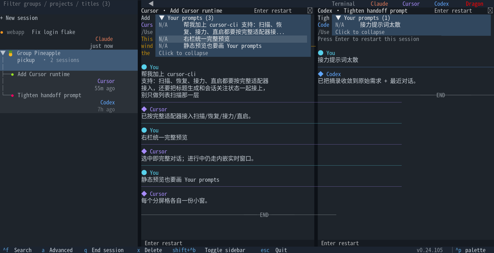
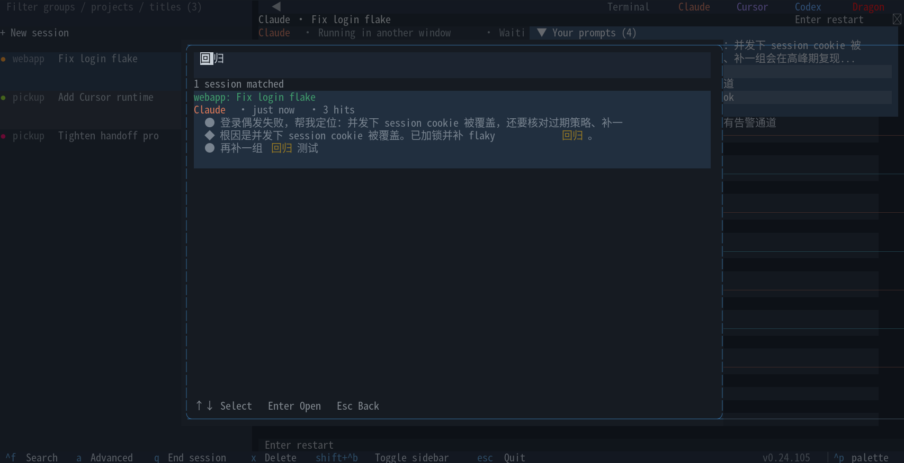

# pickup

**语言：** [English](README.md) | 简体中文

[](https://github.com/x0c/pickup/actions/workflows/test.yml)
[](LICENSE)

面向 Claude Code、Codex CLI、OpenCode、Kimi Code CLI、Cursor Agent CLI 和 Pi 的终端会话选择器。

`pickup` 扫描你本机的 Claude Code、Codex CLI、OpenCode、Kimi Code CLI、Cursor Agent CLI 和 Pi 历史，在终端界面（基于 [Textual](https://github.com/Textualize/textual)）里列出最近的编码会话，并让你用它原本的助手恢复选中的会话。它还能把会话从一个助手接力到另一个（例如 Claude 转 Codex、Pi 转 Claude）：在目标助手里新建会话，并把指向原始历史的结构化线索交给它。

关键词：Claude Code 会话管理、Codex CLI 恢复会话、OpenCode 会话管理、Kimi Code CLI 会话管理、终端 TUI、AI 编码助手工作流、JSONL 聊天历史、跨助手接力。



按 `Ctrl+F` 可以在所有会话的对话正文里搜索，并直接跳到命中的那一行：



## 为什么用它

- 在一块终端屏幕上浏览最近的 Claude Code、Codex CLI、OpenCode、Kimi Code CLI、Cursor Agent CLI 和 Pi 会话。
- 用原助手的原生命令恢复，例如 `claude --resume`、`codex resume`、`opencode -s <id>`、`kimi -S <id>` 和 `agent --resume`。
- 选中已结束的会话即可在右栏预览完整对话（运行中／已托管的会话则显示内嵌终端），也可以让最多三个活跃会话并排。
- 不打开会话也能看出谁需要关注：黄点表示助手在等你回答，绿点表示正在工作，红点表示有未读新结果；详情头会同时写出状态，不只靠颜色传达。
- 全文搜索你说过的一切：`Ctrl+F` 跨全部助手搜索对话正文并展示命中的那一行，让你凭「聊过什么」找回会话，而不必先想起它在哪个项目里。
- 在助手之间接力未完成的工作，不改写、不伪造任何会话文件。
- 复用有容量上限的本地缓存和原生热路径加速，让反复启动、预览和实时画面保持流畅。
- 提供 JSON 输出，方便脚本和启动器调用。

## 隐私模型

本工具以本地优先。

- 它读取本机历史：`~/.claude/projects/`、`~/.codex/sessions/`、`~/.kimi-code/sessions/`、`~/.cursor/chats/`、`~/.pi/agent/sessions/`，以及（只读方式）OpenCode 位于 `~/.local/share/opencode/opencode.db` 的 SQLite 数据库。
- 它自身不上传任何会话历史。
- 跨助手接力传递的是原始历史文件路径，而不是把整段对话塞进命令行参数。
- 可选的标题生成会在本机已安装的助手 CLI 间轮转（包括 Pi），可能消耗对应账号额度。
- 标题缓存和派生性能缓存存放在 `~/.cache/pickup/`，可以本地查看或清空。
- 会话关注状态只在本地保存运行时／会话标识、不透明变化令牌、时间和已读状态，不保存对话正文。Cursor 实时状态会在用户级观察配置中增量加入 pickup 自己的条目，不覆盖已有条目。

详细的隐私与数据流说明见 [PRIVACY.md](PRIVACY.md)。

## 环境要求

- Python 3.10 或更高版本。
- `tmux` 3.2 或更高版本（硬性依赖——会话托管、内嵌面板和 SSH 保活全部构建在它之上；`pickup` 启动时会检查版本，低于 3.2 直接拒绝运行，因为 `new-session -e` 注入环境变量需要 3.2+）。
- macOS 或 Linux 终端（任何现代支持 ANSI 的终端都可以；界面基于 Textual，不是 curses）。
- 想恢复哪种会话，就需要装上对应的 Claude Code、Codex CLI、OpenCode、Kimi Code CLI、Cursor Agent CLI 和／或 Pi。

## 安装

### Homebrew（macOS/Linux）

```bash
brew install x0c/tap/pickup
```

### 安装脚本

```bash
curl -fsSL https://raw.githubusercontent.com/x0c/pickup/main/install.sh | bash
```

需要 Python 3.10+。在受支持的 macOS/Linux 机器上，脚本会直接安装预编译的原生 wheel，只有找不到匹配产物时才回退到源码构建。若安装目录不在 `PATH` 上，脚本会给出提示。

### 从源码安装

```bash
git clone https://github.com/x0c/pickup.git
cd pickup
python3 -m pip install --user .
```

然后运行：

```bash
pickup
```

### 从源码安装（可编辑模式）

```bash
git clone https://github.com/x0c/pickup.git
cd pickup
python3 -m pip install --user -e .
```

然后运行：

```bash
pickup
# 或：python3 -m pickup
```

不要去跑已经删掉的根目录 `pickup.py`；包代码在 `src/pickup/` 下。

## 使用

```bash
pickup                  # 打开交互式终端界面
pickup --limit 30       # 每个助手最多显示 30 个会话
pickup --json           # 以 JSON 打印会话列表后退出
pickup --json --limit 5 # 便于脚本处理的小结果集
pickup --no-input       # 强制走非交互式 JSON 输出
pickup -v               # 显示版本、安装路径和安装渠道
pickup -d               # 打开详细诊断日志
pickup -q               # 抑制非必要的启动提示
pickup --no-color       # 关闭颜色（同时遵循 NO_COLOR）
pickup update           # 手动检查并安装最新版本
pickup cache status     # 查看有容量上限的本地性能缓存
pickup cache clear      # 清空派生元数据与对话缓存
pickup observer status cursor                    # 查看 Cursor 实时状态接入情况
pickup observer install cursor --dry-run --json  # 预演用户级观察配置变更
pickup observer install cursor                   # 显式安装或修复
pickup observer uninstall cursor                 # 只移除 pickup 管理的条目
pickup shim status                               # 查看命令拦截安装情况（敲原命令自动走 pickup）
pickup shim install                              # 安装命令拦截（显式执行才会改 shell 配置）
pickup shim uninstall                            # 移除命令拦截
```

支持常见别名：`-h` / `--help`、`-v` / `-V` / `--version`，以及 `-d` / `--debug` / `--verbose`。

JSON 输出包含助手、会话 ID、标题、工作目录、更新时间、大小、状态、恢复命令和历史路径。

终端界面默认英文。系统语言为中文（`zh*`）时自动切换为中文。可用 `PICKUP_LANG=en` 或 `PICKUP_LANG=zh` 强制指定。

派生缓存默认上限 256 MiB，源历史一有变化对应条目即失效。设 `PICKUP_CACHE=0` 可关闭，`PICKUP_CACHE_MAX_MB` 可调整上限，排查问题时可用 `PICKUP_NATIVE=0` 强制走可移植的 Python 回退实现。

## 内嵌面板（同时处理多个会话）

`pickup` 是一条统一按时间排序的会话时间线：Claude Code、Codex CLI、OpenCode、Kimi Code、Cursor Agent 和 Pi 的会话混在同一个列表里，而不是按助手分标签页。每张卡片占三行，分别是「圆点 项目 标题」、助手名、更新时间。标题正在生成时卡片只显示兜底标题、不画加载动画，生成好了再就地刷新。右侧跟随选中项：已结束的会话展示完整对话并钉在最新消息，已托管的会话则渲染实时终端。右侧上方的助手按钮可以在同一项目下再加一格，最多四格并排，且这个组合会被记住。列表一旦显示出来顺序就是稳定的——卡片不会因为内容更新而跳来跳去，只有真正新增的会话才会出现，且总是插在最上面。

首行最左的小圆点刻意只表达最需要关注的一件事：

- 黄点——助手提出了结构化问题，正在等你回答；
- 绿点——当前轮仍在执行，且没有等待回答；
- 红点——助手产生了你还没读过的新结果或结束状态；
- 无圆点——会话空闲且已读。

同一张卡只显示一个圆点，优先级为「黄 > 绿 > 红」。因此黄色和绿色不会重叠：等待回答时黄点临时盖过绿点，普通执行过程仍会稳定显示绿点。圆点不会改变会话排序，不提供筛选、计数、声音或系统通知。红点只有在右侧内容已成功加载并稳定可见 0.5 秒后才清除；快速掠过、预览失败或切走应用都不会误标已读。升级后的首次启动会把已有历史作为已读基线，避免旧会话全部亮红。

Claude Code、Codex CLI、OpenCode 和 Kimi Code 从本地历史推导这些信号；Cursor 还通过用户级观察配置提供实时轮次边界。pickup 会在后台幂等安装自己的观察条目，保留其他条目，变更前备份并原子写入；观察失败时直接放行，绝不阻断 Cursor。可用上面的 `pickup observer ... cursor` 命令查看、预演、修复或移除这项接入。

- 第一行是固定的「＋ 新建会话」（英文界面为 `+ New session`），永远不会被滚走：在它上面按 `Enter` 可以选择项目目录和助手，新建的空白会话会直接托管在右栏。
- 点击右侧上方的助手按钮，即可在当前项目下把该助手加为另一格。最多四格同时运行；点击某一格可让它获得焦点，侧边栏选中项随之同步。
- 两到四个会话以分屏打开后，会自动形成一个水果名会话组，例如 `Group Apple`、`Group Pineapple`。组卡固定三行，成员移到下面的缩进树中，不会再在顶层重复出现；组内子项不再重复显示项目名（项目已写在组卡上）。未置顶区跟列表稳定顺序走：进入后已有项不会因成员 mtime 更新而上下飘，只有新建会话会插到最前；按 `p` 置顶的才会固定在最上。组标题不显示关注圆点，圆点仍只属于各个会话。当前只高亮会话组标题和正在使用的那个子会话。组卡上按空格可以收起／展开；按 `p` 可以置顶／取消置顶独立会话或整个会话组，组内单个会话不能脱离组单独置顶。
- **每个实时格的右上角都浮着一个会话小窗**，扫一眼就知道这一格在干啥、进行到哪。它默认展开，展示最多 6 条带时间的提问，**顺序一律由旧到新**；超过 6 条时省掉的是中间那段（最早那条一定保留），并会写明省了多少条。过长提问最多两行、末行加省略号，续行缩进到与首行对齐；提问行带浅斑马纹。内容超过小窗的最大高度时，正文可以滚轮翻看，标题和"点击收起"始终留在原处。runtime 注入的提示词（计划附件、接力词、管家角色提示等）不会出现。点它（或按 `Ctrl+G`）可收起成三行，只给两头：`▶ 12 条提问`、`最初 <本会话第一条提问>`和`最近 <最新那条>`。多分屏时每一格各自一份；静态预览格同样画小窗。
- 在侧边栏卡片上按 `Ctrl`/`Cmd` + 点击（或按空格）可切换多选；选中两到四个后按 `Enter` 会以分屏方式打开（已结束的会话显示对话预览，运行中／已托管的会话显示内嵌终端）。`Esc` 会先清空多选。普通点击或方向键也会退出多选。
- `Enter` 在右栏恢复选中的会话（若已托管则重新接上那个实时终端），**并把键盘输入交给那一格**——可以立刻开始对助手打字，不需要再点一下鼠标。方向键浏览永远不会抢焦点（也不会启动任何助手），列表始终可用；`Ctrl-\` 把输入交还给列表。
- 点击会话卡的效果和 `Enter` 一样。点击是对称的开关：点击当前持有输入的那一格对应的卡片，键盘控制权回到侧边栏（等价于 `Ctrl-\`，会话继续运行）；再点一次又进去。直接点击某一格也是接管它的等价方式。
- 焦点在侧边栏时，实时格会压暗，并在状态条上写明输入不会进入那里——避免你对着一个没在听的格子打字。
- 右栏持有焦点时，`Ctrl-\` 把键盘焦点交还给列表。已托管的会话继续在后台运行。
- 滚轮跟随鼠标所在位置，与键盘焦点无关：在右栏上滚动对话预览或实时历史，在左侧边栏上滚动会话列表。处于实时最新处时，需要滚轮输入的助手会直接收到滚轮事件；否则由 pickup 翻阅 tmux 历史。
- 在内嵌面板里拖拽即可选中文本——松开鼠标会自动经 OSC 52 复制（终端支持时，SSH 下同样有效）。需要时 `Ctrl+C` 仍可重新复制当前选区。
- 终端光标会停在助手自己的光标位置上，因此输入法预编辑候选框（如中文输入法）会出现在助手的输入框旁边，而不是屏幕底部。
- 在 tmux ≥ 3.5a 上修复了面板内的深浅色主题识别：`pickup` 启动时探测你真实终端的背景色，并喂给每个托管面板（`refresh-client -r`），于是查询 OSC 11 的助手能拿到真值。已经在运行的助手仍沿用它之前的猜测——重启它们，或手动设一次主题即可。
- `c` 关闭当前聚焦的那一格；它托管的会话继续在后台运行，随时可以用 `Enter` 重新打开。
- 在后台运行中／进行中的会话上按 `q`，再按一次 `q` 确认即可结束它；用 `Esc` 退出 `pickup` 永远不会杀掉任何东西——一切都留在 tmux 里继续活着。

## 直启子命令

`pickup claude [参数...]`、`pickup codex [参数...]`、`pickup opencode [参数...]`、`pickup kimi [参数...]`、`pickup cursor [参数...]` 和 `pickup pi [参数...]` 会启动一个全新会话。在真实终端里，它们会打开同一套侧边栏界面，新会话已经托管在右栏并获得焦点；在非真实终端（管道／脚本）中，或加了 `--no-keepalive` 时，则按传统方式直接接管整个终端。

助手名后面有两种写法：

1. **项目快捷方式** —— 第一个参数**不以** `-` 开头（例如 `pickup claude subswap`）：模糊匹配一个本地项目（会话历史里的工作目录 ∪ `$HOME` 下的 git 根目录，可用 `PICKUP_PROJECT_ROOTS` 覆盖），然后在该目录下打开一个空白会话。匹配到多个时给出带编号的选择器。项目名之后再跟额外参数会被拒绝。
2. **参数透传** —— 没有参数，或第一个参数以 `-` 开头（例如 `pickup claude --resume id`）：其余参数原样交给底层 CLI；`pickup` 只会在你尚未自己带上时补一个该助手的免审批参数，并用[会话保活](#会话保活扛住-ssh-断线)托管。

```bash
pickup claude                       # 在当前目录新建空白 Claude 会话（托管在界面里）
pickup claude subswap               # 在匹配到的项目目录里新建空白 Claude 会话
pickup claude --print "hi"          # 把参数透传给 claude
pickup codex --resume <id>          # 执行 `codex --resume`，自动免审批并托管在界面里
pickup opencode                     # 新建空白 OpenCode 会话，托管在界面里
pickup kimi                         # 新建空白且免审批的 Kimi 会话，托管在界面里
pickup pi                           # 新建空白且免审批的 Pi 会话，托管在界面里
pickup --no-keepalive claude        # 传统的全终端接管启动，不套后台 tmux
```

OpenCode 用的是它自己的 `--auto`（自动批准所有未被显式拒绝的权限请求），pickup 会替你补上。位置有讲究：`--auto` 只属于主命令和 `opencode run`，且必须排在子命令后面（写成 `opencode --auto run …` 会被当成「在名为 run 的目录里开 TUI」）。所以 `pickup opencode run …` 会补成 `opencode run --auto …`，而 `pickup opencode stats` 这类不认该参数的子命令原样透传、不补。若你的 opencode 还不认识 `--auto`，升级到新版即可。

Cursor 可以用你平时敲的命令名直接进来：`pickup agent` 和 `pickup cursor-agent` 与 `pickup cursor` 完全等价（Cursor 的安装脚本同时提供 `agent` 和 `cursor-agent` 两个入口）。

## 命令拦截（敲原命令自动走 pickup）

装完拦截以后，在终端里正常敲 `claude`、`codex`、`opencode`、`kimi`、`cursor-agent`、`pi`，就等于敲了 `pickup <助手>`：新会话直接被托管、带上免审批参数、断线也不会丢。

```bash
pickup shim status                  # 查看当前 shell 装没装、拦了哪些命令
pickup shim install                 # 安装（会往 shell 配置里加一小段带标记的引用）
pickup shim install --dry-run --json  # 只预演，不写任何文件
pickup shim install --include agent # 额外拦截通用名 agent（默认不拦，见下）
pickup shim uninstall               # 只移除 pickup 加的那一段，其余配置原样保留
```

支持 bash / zsh / fish，默认按 `$SHELL` 自动探测，也可以用 `--shell` 显式指定。**pickup 不会自动改你的 shell 配置**——只有你显式执行 `pickup shim install` 才会写入，写之前还会把原文件备份一份。

下面这些情况一律原样执行原命令，不会被托管：

- 无头 / 脚本调用（`claude -p "..."`、`codex exec ...`、管道、CI、编辑器插件、别的 Agent 拉起的子进程）；
- 管理类子命令（`claude update`、`cursor-agent login` 等）；
- 已经在 tmux／screen／pickup 托管会话里（不会套第二层）；
- 找不到 `pickup` 命令时（例如你卸载了 pickup）——你的原命令永远保底可用。

`agent` 默认不拦：Cursor 占用了这个很通用的名字，自动拦截容易遮蔽你机器上的其它同名工具，需要就用 `--include agent` 显式打开。

## 会话保活（扛住 SSH 断线）

从界面里启动或恢复的会话，默认会被包进一个专用的后台 `tmux` 服务（`tmux -L pickup-keepalive`，使用内置配置，**不会**读你自己的 `~/.tmux.conf`）。SSH 连接断了、或者你合上笔记本，底层的 `claude`/`codex` 进程仍在远端机器上继续跑。重新打开 `pickup`，该会话显示为「后台运行中」，按 `Enter` 是重新接上它，而不是另起一个互相竞争的进程。

- 按 `Ctrl-\`（不需要前缀键）即可脱离并回到你的 shell，会话继续运行；标准的 `Ctrl-b d` 同样有效。
- 在后台运行中／进行中的会话上按 `q` 可结束它（再按一次 `q` 确认）。
- 空闲会话（tmux 无活动）默认 6 小时后自动回收；可用 `PICKUP_KEEPALIVE_IDLE_HOURS` 调整（设 `0` 关闭回收；旧变量名 `SC_KEEPALIVE_IDLE_HOURS` 仍然可用）。回收只关掉后台 tmux 会话，历史仍留在磁盘上。
- 单次运行想关掉保活用 `pickup --no-keepalive`，永久关闭用 `PICKUP_KEEPALIVE=0`（旧名 `SC_KEEPALIVE=0` 也可用）。
- 当 `pickup` 本身已经跑在 `tmux`/`screen` 里时，会跳过「全屏接管」那种形式的保活（不做嵌套）；内嵌面板不需要 attach，在这种环境下照常工作。

## Agent／自动化

`pickup` 还提供一组只读的结构化子命令，供 AI Agent 查询本机会话历史——列出、搜索、查看详情、构建接力上下文包，以及生成原生续接计划。它们都不会启动或恢复任何东西；拿到数据和计划之后怎么用，由调用方自己决定。

```bash
pickup list --cwd my-app --status pending --top 5 --compact # 紧凑、限量的会话列表
pickup search weather app --top 3 --compact                 # 按相关性排序的主题搜索
pickup search weather app --deep                            # 额外全文搜索对话内容
pickup show <session-id-prefix> --messages 10 --compact     # 会话详情 + 最近对话
pickup show <session-id-prefix> --full --out /tmp/pickup.json # 大结果输出落盘
pickup context <session-id-prefix>          # 接力包：历史路径、建议提示词、恢复命令
pickup plan continue <runtime:id> --instruction "继续未完成的工作" # 只给 argv/cwd 计划，不执行
pickup describe [command]                   # 机器可读的命令／参数／字段说明
```

每个命令都输出统一的 JSON 信封（`{ok, data, error, meta}`），并使用细分的退出码（`0` 成功，`2` 用法错误，`3` 未找到，`5` 会话引用有歧义）。在非真实终端下（管道、脚本或被 Agent 调用）不带子命令直接运行 `pickup`，同样会回退成输出 JSON 会话列表，而不是尝试启动终端界面。

对 `list` 和 `search` 而言，`--limit` 是每个助手的扫描深度，`--top` 才是最终返回条数上限。`search` 会返回 `score`、`matched_via` 和 `matched_fields`；`list`/`search` 的每一行都带 `resumable` 和 `resume_command`，便于自动化判断是就地恢复还是重开一个。`pickup plan continue` 把这个决定转成结构化的只读执行计划（`argv` 和 `cwd`），既不是 shell 命令字符串，也不会真的拉起进程。

完整的命令参考、字段语义和典型 Agent 工作流见 [docs/SKILL.md](docs/SKILL.md)。

## 快捷键

| 按键 | 作用 |
| --- | --- |
| `Up` / `Down` / `j` / `k` | 移动选中项 |
| `/` | 聚焦侧边栏筛选框（对组名、项目名、路径和会话标题做大小写无关的模糊匹配） |
| `Ctrl+F` | 在所有会话的对话正文里全文搜索；结果展示命中的那一行，按会话时间由新到旧排。`Enter` 在侧边栏中打开选中的会话 |
| `Enter` | 用原生助手恢复选中的会话（若已在后台运行则重新接上）；在固定的第一行「＋ 新建会话」（英文 `+ New session`）上则进入新建流程 |
| `a` | 打开高级接力操作 |
| `q` | 结束后台运行中／进行中（保活）的会话；在确认框里再按一次 `q` |
| `x` | 永久删除选中的本地会话（光标在会话组上时删除整组全部会话）；在确认框里再按一次 `x` |
| `c` | 关闭当前聚焦的右侧格，不结束它托管的会话 |
| `p` | 置顶／取消置顶选中的独立会话或会话组 |
| `Ctrl+Shift+B` | 显示／隐藏侧边栏（也可用助手顶栏上的 ◀/▶ 开关） |
| `Ctrl+G` | 展开／收起实时格右上角的会话小窗（点击小窗本身效果相同） |
| `Home` / `End` / `PgUp` / `PgDn` | 滚动右栏对话预览（也可以把鼠标放在该栏上用滚轮） |
| `F12` | 把诊断截图保存到 `~/.cache/pickup/screenshots/` |
| `Esc` | 清空搜索／关闭弹窗，或退出 |

`Enter`（或点击）把输入交给托管中的助手；`Ctrl-\` 把键盘焦点交还侧边栏，不会结束进程。`Ctrl+Shift+B`（或助手顶栏左侧的 ◀/▶ 开关）可显隐侧边栏，让右侧格用满整个宽度，该偏好会跨次启动记住。（不用 `Ctrl+B`：Claude Code 里它是「把当前任务转后台」，留给它。）实时格持有输入时，侧边栏的快捷键会主动让路，让按键送达助手。无论焦点在哪一侧，鼠标滚轮在任一栏上都能用。

## 跨助手接力

侧边栏对会话按 `Enter` 是原生恢复（同一助手、保留原会话完整上下文）。

高级操作（`a`）一律**新建会话**并读取源历史——选其他助手或选同一个助手都可以（原会话卡住 / 出 bug 时用同助手另起）。新会话默认出现在被接力会话旁边。提示词中包含：

- 源助手名称；
- 原会话标题；
- 原工作目录；
- 原历史位置（Claude/Codex/Kimi 是 JSONL 文件，OpenCode 是 SQLite 数据库加会话 ID）；
- 读取该历史的简短格式提示。

原会话历史保持原样不动（只读打开）。继续工作前需要读哪些历史，由目标助手自己决定。

## 标题生成

界面先显示一个本地兜底标题，保证首屏立刻可用。随后一个脱离的后台进程会通过本机可用的助手 CLI，分小批生成更好的中文标题。Pi 的标题请求带 `--no-session --no-tools --print`，不会写入 Pi 历史，也不会调用工具。

成本控制：

- 生成的标题按助手和会话 ID 缓存；
- 文件锁防止重复起标题生成进程；
- 失败、超时、非法或缺失的结果一律保留本地兜底标题；
- 失败过的标题不会在后续启动时自动重试，避免反复消耗账号额度。未来的标题缓存版本升级可能会按新规则重试。

标题生成实际上是可选的：即使没有可用的生成器或生成失败，会话选择器照常工作。

## 客户端自动更新

界面每次启动时都会在后台检查是否有新版本（一次对公开 GitHub API 的 HTTPS 请求，见[隐私模型](#隐私模型)）。如果你的安装方式支持就地升级（Homebrew tap、`pipx` 或基于 `pip` 的安装），右下角会出现一个小提示；点它即可更新，然后可以顺手就地重启 `pickup`。升级会直接安装随版本发布的预编译包，本机无需 Rust 工具链。忽略当天的提示只需一次点击——升级失败时同样可以关掉，且提示里会附上一行简短的失败原因。源码／开发检出永远不会被打扰——这种安装路径下检查会被完全跳过。

你也可以随时手动触发同样的检查，无需打开界面：

```bash
pickup update
```

## 项目结构

| 路径 | 用途 |
| --- | --- |
| `src/pickup/` | 可安装的包（src-layout） |
| `src/pickup/cli.py` | 进程入口、参数解析、直启分发 |
| `src/pickup/store.py` | 会话仓库／快照刷新 |
| `src/pickup/display.py` | 宽度、卡片、预览、筛选辅助函数 |
| `src/pickup/theme.py` | OSC 探测与助手标签配色 |
| `src/pickup/ui/` | Textual 界面：主屏、弹窗、会话列表、分屏区、助手顶栏、内嵌面板 |
| `src/pickup/ui/search_modal.py` | 全文搜索弹窗（`Ctrl+F`） |
| `src/pickup/search.py` | 会话对话正文的内存全文索引 |
| `src/pickup/split_layout.py` | 持久会话组、折叠状态与侧边栏置顶 |
| `src/pickup/embed.py` | 内嵌面板宿主（`capture-pane` / `send-keys`） |
| `src/pickup/agent_api.py` | 只读的 `list`/`search`/`show`/`context`/`describe` |
| `src/pickup/keepalive.py` | 基于 tmux 的保活包装层 |
| `src/pickup/models.py` | 共享的会话／接力／启动计划模型 |
| `src/pickup/runtime/` | 各助手适配器 |
| `src/pickup/scan/` | 各助手的历史扫描器 |
| `src/pickup/titles.py` / `titlegen.py` | 标题缓存与生成器 |
| `src/pickup/updater.py` | 客户端自动更新：版本检查、渠道识别、就地升级 |
| `tests/` | 单元测试 |
| `docs/SKILL.md` | 面向 Agent 的命令参考 |

## 开发

```bash
python3 -m pip install --user -e .
python3 -m compileall -q src/pickup tests
python3 -m unittest discover -s tests -v
```

改动界面时还要做一次真实终端冒烟测试（内嵌／保活相关路径用 `bash selftest.sh`）。

维护者笔记见 [AGENTS.md](AGENTS.md) 和 [docs/MAINTAINER_GUIDE.md](docs/MAINTAINER_GUIDE.md)。

## 许可证

MIT，见 [LICENSE](LICENSE)。
