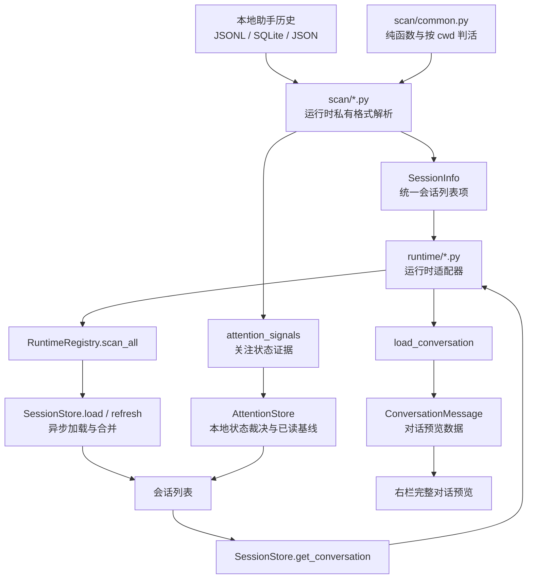
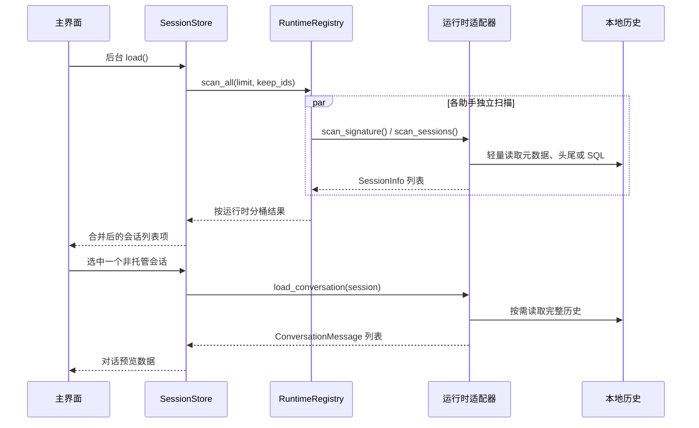
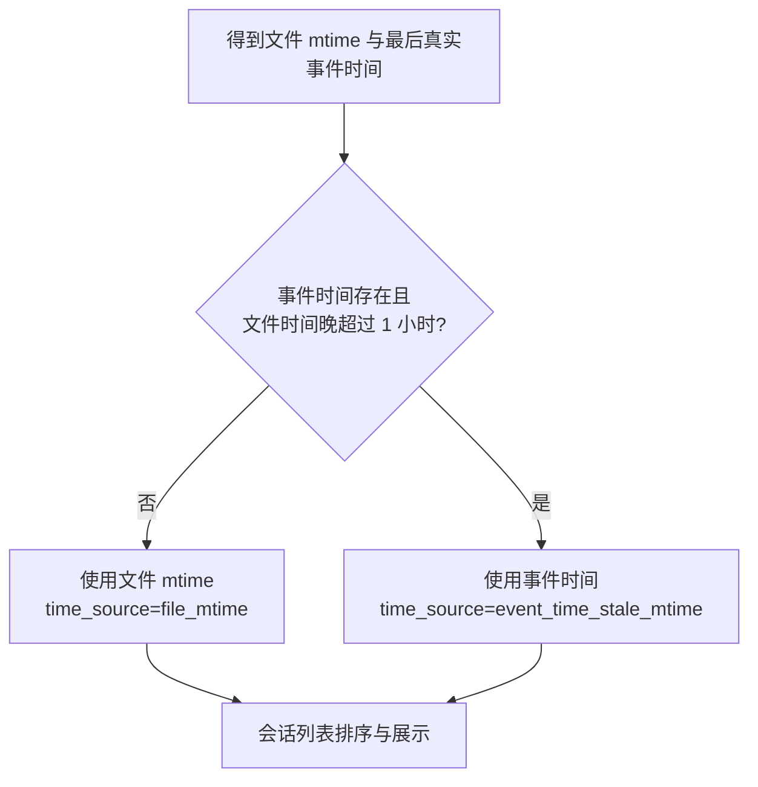

# 会话扫描与对话内容领域知识库

## §0 目录索引

| § | 标题 | 定位 |
|---|------|------|
| §1 | 业务背景与核心概念 | 首次接触会话扫描时读 |
| §1.5 | 架构概览 | 理解本地历史到预览的分层与调用关系 |
| §2 | 核心业务流程 | 修改扫描、排序、缓存或预览前读 |
| §2.5 | 物理路径速查 | 直接定位扫描与适配实现 |
| §3 | 代码入口索引 | 按任务场景找正确入口 |
| §4 | 外部数据入口索引 | 排查本地历史格式、路径和存储形态时读 |
| §5 | 流程、组件与缓存入口索引 | 改并发扫描、判活、缓存时读 |
| §6 | 核心业务规则与隐性约束 | 改代码前必扫的 AI 易错点 |
| §7 | 验证路径 | 改完扫描或预览后执行 |
| §8 | 关联文档 | 跨域改动时联读 |
| §9 | 覆盖度与待补充项 | 了解证据范围与缺口 |

## §1 业务背景与核心概念

corral 的会话扫描负责从本机已安装助手的私有历史中读取可恢复会话，转换成统一的**会话列表项**（`SessionInfo`），供主界面、只读查询和接力编排复用。扫描是只读的：不修改历史、不启动助手，也不把历史同步到业务数据库或远程服务。

本域服务两个用户可见目标：

1. 主界面能尽快显示跨助手、按最近活动排序的会话列表，并给出工作目录、标题、时间、进程活性和会话关注状态。
2. 用户选中已结束或未托管会话时，按需读取完整历史，将其转换为**完整对话**（`ConversationMessage`）供右栏预览；列表扫描本身不能为了预览而全量读大文件。

核心概念统一如下：

| 主称谓 | 实现名称/来源 | 业务含义 |
|---|---|---|
| 会话扫描 | `scan_sessions()` | 从某一助手本地历史产生会话列表项的轻量读取过程 |
| 会话列表项 | `SessionInfo` | 统一的跨助手会话元数据：标识、目录、时间、标题、摘要、状态、判活结果和历史入口 |
| 对话预览数据 | `ConversationMessage` 列表 | 从原始历史按时间顺序提取的真人用户消息与助手文本，供右栏展示 |
| 完整对话 | `ConversationMessage` | 对话预览数据中的单条消息；角色只能是 `user` 或 `assistant` |
| 有效会话时间 | `mtime` / `time_source` | 列表排序和展示使用的时间；通常是文件更新时间，疑似被元数据污染时回退真实事件时间 |
| 原生标题 | `native_title` | 助手历史已有的标题；可为空，不能替代完整标题补全策略 |
| 兜底标题 | `fallback_title` | 扫描期从首尾真实对话提取的无需模型调用的标题 |
| 运行中 | `live` / `pid` | 进程活性探测的结果，用于判断会话是否仍有本地进程 |
| 关注状态证据 | `AttentionEvidence` | 从本地历史或 Cursor 观察事件中提取的执行、等待、结束变化；不等于机器接口状态 |
| 关注状态 | `AttentionState` | 面向侧边栏的单一裁决：等待回答黄 > 执行中绿 > 未读新结果红 > 无 |

本域边界：

- 包含：六种助手的历史格式解析、统一会话列表项、轻量排序与过滤、判活、关注状态证据、完整对话按需加载、扫描签名跳过、预览缓存失效。
- 不包含：终端界面布局与交互、托管会话实时画面、标题生成算法、跨助手接力提示词的渲染规则、机器接口 JSON 契约全文。
- 接力只消费本域导出的历史入口和对话预览数据；接力如何生成或执行目标命令属于“跨助手接力与启动”域。

## §1.5 架构概览





## §2 核心业务流程

### 2.1 首次扫描与统一列表

1. `SessionStore.load()` 在后台运行；主界面先展示骨架，不能因为扫描尚未完成而误报“没有会话”。
2. `RuntimeRegistry.scan_all(limit, keep_ids_by_runtime)` 为各助手并发启动独立扫描，重叠磁盘 I/O；单一运行时解析失败被隔离，不得拖垮其余助手。`keep_ids_by_runtime` 来自侧边栏记忆里的置顶键和分组成员（`remembered_ids_by_runtime()`），按 `runtime:id` 拆开；扫描器即使超过 `limit` 也必须把这些 id 留在结果里。
3. 每个适配器调用自身 `scan_sessions(limit)`，只读取形成会话列表项所需的轻量数据：
   - Claude、Codex：候选 JSONL 文件按真实文件 mtime 排序，只解析到足够有效项为止。
   - Kimi：按主 `wire.jsonl` 的 mtime 排序，读取 `state.json` 与主 agent 事件流的头尾。
   - OpenCode：一次只读 SQL 获取顶层、未归档会话与摘要。
   - Cursor：只读 `meta.json` 和 `prompt_history.json`；不在列表阶段打开 `store.db`。
   - Pi：递归 `~/.pi/agent/sessions/**/*.jsonl`。列表身份 = jsonl header 的 `id`（不是文件名 ident）。v0.24.146 起新托管会话写回 Pi 默认 cwd 平铺目录；旧 `corral-<ident>/` / `pickup-<ident>/` 只读兼容并在交互启动时安全复制主会话回默认目录。旧隔离目录仍单独计算 `limit`，仅为迁移期兼容；禁止继续靠增加隔离配额或“目录最新文件”启发式修补。置顶/分组成员的 `keep_ids` 仍不计入配额。
4. 各扫描器返回字段完整的会话列表项，按有效会话时间降序排列。`SessionStore._merge_scanned()` 合并所有来源；已在列表出现过的会话位置稳定，新出现会话才按时间插入顶部。
5. `keepalive.annotate()` 可在合并后补充托管标记；这不改变扫描器只读本地历史和进程状态的边界。
6. 刚由 corral 创建、还没产生第一条用户消息的 Codex 会话，只有在进程仍运行时才保留并显示为「Codex 新会话」；进程已结束的空记录继续过滤，避免旧的无效记录占满列表。
7. Codex 的用户与助手正文同时兼容旧事件流和新版响应记录；新版首轮会混入运行环境说明，必须跳过这类注入内容，继续读到真实任务文本。否则真实会话会被误判为空会话、标题生成只会得到「新会话」之类无意义输入。同一句真人输入还会各写一遍 `response_item` 和 `event_msg`，`load_conversation` 必须按相邻正文去重，只留先到的那条。

### 2.2 运行中判定

“运行中”是会话关联进程是否存活的二值事实，而不是会话对话状态。

| 助手 | 判活来源 | 归属规则 | 降级行为 |
|---|---|---|---|
| Claude | `~/.claude/sessions/<pid>.json` + `os.kill(pid, 0)` | 文件中的 `sessionId` 映射到 pid | 注册文件损坏或进程不存在则视为已结束 |
| Codex | 活着的 `codex` 进程持有的 `rollout-*.jsonl` | 从打开的文件名提取会话 UUID；再按进程祖先链关联回 Corral 托管窗口 | Linux 读 `/proc/<pid>/fd`；macOS 合并一次 `lsof`。启动包装器可在一个托管窗口内先后拉起多层 Codex 进程，未出现确切 UUID 时必须保留占位态，不能用短托管标识或同目录最新记录认领 |
| OpenCode | 命令行 `-s` / `--session`；完整 `CORRAL_SESSION_ID`；其余 TUI 按「进程启动 ≤ 会话创建」一对一认领 | 禁止再按「同 cwd 仅最新一条」猜测。`run`/`serve` 等子命令不算 TUI。`--prompt` 后的接力说明词不当 argv | 无法探测时返回空映射 |
| Kimi | 命令行 `-S` / `--session`；完整 `CORRAL_SESSION_ID`；其余 TUI 按「进程启动 ≤ 会话创建」一对一认领 | 禁止再按「同 cwd 仅最新一条」猜测。`-p` 打印模式与 `server` / `web` 不算 TUI | 无法探测时返回空映射 |
| Cursor | `agent` 进程；优先解析命令行 `--resume <chatId>`，其次读打开的 `store.db` 路径，再次读 `CORRAL_SESSION_ID`/`SC_SESSION_ID`。命中的 chat 若是 Task/subagent（`meta.isSubagent` 或 `store.db` 的 `subagentInfo`），改绑到 `rootParentAgentId` / `parentAgentId` 对应的父会话 | 只按上述正向证据精确绑定；禁止再按「cwd → 最新会话」猜测。空白新建的临时 8 位标识不参与匹配。**子代理不得进列表，但其活进程必须让父会话保持进行中** | 无法探测时返回空列表 |
| Pi | 当前实现依次尝试打开的 jsonl、隔离目录最新 jsonl、进程内记忆、`--session` / `--session-id`、完整 `CORRAL_SESSION_ID` 和启动时间配对 | **当前实现已证实会错绑，禁止作为新方案继续沿用**：Pi subagent 继承 `PI_CODING_AGENT_SESSION_DIR` 后与主会话写进同一目录，“目录最新文件”会稳定选中 subagent。后续必须以明确的 pane↔顶层会话身份关联为准，`parentSession` 子会话不得成为 pane 属主；不得再用 cwd 最新或目录最新猜测。`-p` 与 `auth`/`install` 等非交互命令仍不算 TUI | 无法取得明确身份时保留占位态或降级为未绑定，禁止抢别人的会话 |

### 2.2.1 Pi 每会话隔离目录故障与替换约束（2026-08-26 裁定）

用户可见症状是“新开的 Pi 会话切走后消失”“标题和 Your prompts 挂到另一个空 Pi 分屏”“Pi 原生 `/resume` 看不到其它会话”。四路调研（Pi 0.84.2 源码、官方 issue 与同类项目、Corral git 考古、suzhou 现场取证）确认它们来自同一套隔离设计，不能在原方案上继续打补丁。

1. **Pi 的默认会话模型是按 cwd 分组、目录内平铺 JSONL。** 自定义 `--session-dir` 不只改写入位置，还把 `/resume`、`pi -c`、`--session` / `--session-id` 的查找范围一起圈进该目录；扫描不递归。Corral 的 `--<cwd>--/corral-<ident>/` 二层布局因此对原生恢复不可见，`/resume` 的 All 视图也会退化成只看当前隔离目录。
2. **隔离目录不是“一条主会话一个房间”。** Pi subagent 继承 `PI_CODING_AGENT_SESSION_DIR`，把带 `parentSession` 的子会话 JSONL 写入同一目录。当前 `bind_session_dir()` 与占位卡 newcomer 认领都取该目录 mtime 最新文件，结果会把主 Pi pid/tmux 名贴给 subagent。2026-08-26 现场直接看到主会话 `9f84d92d` 变成 `live=false`，subagent `01a03c1b-…` 反而拿到 `corral-pi-9f84d92d`。
3. **标题缓存没有串。** 标题仍按 `pi:<header id>` 分离；错的是 pane 的 `session_key` 被 keepalive 迁移到错误子会话，标题和 Your prompts 再按错误 key/path 正常渲染，所以两者一起“挂错”。
4. **Pi 首条助手回复完成前不创建 JSONL。** 进程启动后目录可以为空数分钟；只靠扫文件发现会话存在盲区。当前会话 11:15:47 启动，JSONL 到 11:19:26 才创建。占位态不得因暂时无文件被清掉，也不得在此期间认领同项目其它文件。
5. **Pi 0.84.2 没有跨进程写锁。** 同一会话被两个进程同时打开会交错写入或形成同 id 多文件；恢复前必须确认旧 writer 已退出。上游 #8300、#8177、#8334 均未提供可依赖的 CLI 锁。

【产品与架构裁定】**禁止再把“每个 Corral Pi 会话独占一个 `--session-dir` / `PI_CODING_AGENT_SESSION_DIR` 小房间”作为目标方案。** v0.24.146 已移除新启动路径的隔离注入，并显式清空从旧父进程继承的 `PI_CODING_AGENT_SESSION_DIR`；不要用递归补扫、扩大 quota、过滤一批已知 subagent 名称或继续调“最新文件”顺序来延寿。

后续方案评审必须同时满足：

- 会话文件回归 Pi 默认 cwd 目录，裸 `pi`、Corral 托管会话和 `/resume` 看到同一个世界；新建可在项目默认目录内用 `--session-id` 固定身份，恢复必须走找不到即失败的 `--session`，不能把恢复失败静默变成空会话。
- pane/tmux 与顶层 Pi 会话用明确 id 关联；`parentSession` 指向父会话的 subagent/分叉记录不得成为顶层 pane 属主。
- 一个会话同一时刻最多一个 writer；外部所有权记录只做防双开，不得取代 Pi JSONL 这个会话事实源。
- 第一条助手回复前保留 provisional 绑定；落盘后按明确 id 转正，不能按 cwd、mtime 或“最新一条”抢占。
- tmux 继续只负责进程生命周期与画面 attach；这是 Pi 官方明确推荐的并行方式，不需要改成隔离工作区或自建会话存储。

外部依据：Pi 官方 [sessions](https://github.com/earendil-works/pi/blob/main/packages/coding-agent/docs/sessions.md)、[#4874](https://github.com/earendil-works/pi/issues/4874)、[#6407](https://github.com/earendil-works/pi/issues/6407)、[#8300](https://github.com/earendil-works/pi/issues/8300)、[#5700](https://github.com/earendil-works/pi/issues/5700)。Pi Server/SessionLease 仍是实验 API，短期不得押注；可预留未来替换边界。

### 2.3 完整对话按需加载

1. 用户选中会话后，`SessionStore.get_conversation()` 以“运行时 + 会话 ID”定位预览缓存。
2. 先检查进程内缓存，再按历史入口的设备、inode、字节数和纳秒修改时间检查本地派生缓存；签名未变化则复用已有对话预览数据。
3. 签名变化或无缓存时，定位对应运行时适配器的 `load_conversation(session)`。
4. 适配器委托相应 `scan.*.load_conversation` 读取完整对话；原始系统事件、思考分片、工具定义和空文本不进入完整对话。
5. 返回的消息按时间顺序同时写入进程内缓存和有界本地派生缓存，再交给右栏。解析失败返回空列表，不得因一个损坏历史文件导致主界面崩溃。

### 2.4 会话时间与排序

`effective_session_time(file_mtime, event_time)` 统一处理“文件看似刚更新、真实对话却很久以前”的情况：



这避免 Claude/Codex 驻留、同步、复制或元数据刷新只 touch 文件而让旧会话误排到顶部。OpenCode 使用数据库的 `time_updated`，其 `time_source` 为 `db_time_updated`。

### 2.5 扫描签名跳过

后台刷新会反复调用 `scan_all()`。只有可靠的廉价签名才允许跳过完整扫描：

1. OpenCode 的签名包含数据库及可选 `-wal` 文件的 mtime，以及排序后的 `(pid, cwd)` 全量进程快照（不再按 cwd 折叠成单 pid）。
2. 签名不变时复用上一份成功扫描结果，但必须复制每个会话列表项，禁止让界面就地添加的展示字段污染缓存。
3. OpenCode 读取失败时保留上一份成功结果，不能用空列表覆盖。
4. Claude/Codex 不使用父目录签名：多层目录下文件追加不会可靠更新父目录 mtime。两者逐文件使用精确签名复用已解析元数据；Codex 还把会话名称索引签名纳入版本。
5. Kimi 按主事件流文件精确签名复用元数据；Cursor 按元数据文件签名，并额外绑定提示历史与正文数据库签名。缓存写意图在全部运行时扫描完成后一次事务提交，避免逐条同步写盘。
6. 这些缓存是可删除的本地派生数据；损坏、锁竞争或禁用时必须按未命中处理，不能改变扫描结果。完整边界见 `PERFORMANCE_KNOWLEDGE_BASE.md`。

### 2.6 关注状态证据与裁决

1. Claude Code、Codex CLI、OpenCode 和 Kimi Code 从各自本地历史的明确事件推导执行阶段与结果变化；只有对应运行时的结构化提问记录仍未得到结果时才标记「等待回答」，禁止对自然语言问句做关键词猜测。
2. Cursor 的历史数据库可提供结果变化和结构化提问信号；实时执行边界优先来自用户级 hook 观察事件。观察器在 TUI 后台幂等安装，故障时直接放行，不得阻断 Cursor。
3. 状态库按“运行时 + 会话 ID”保存活动令牌、问题令牌、观察时间、当前裁决与已读基线，不保存标题、提示词、回答或工具正文。占位会话转为正式会话时状态必须随会话身份迁移。
4. 裁决优先级固定为等待回答 > 执行中 > 未读新结果 > 无。黄点覆盖绿点只表示用户输入成为更高优先级，不能把执行状态和等待状态合并；绿点仍覆盖所有未等待回答的正常工作阶段。`live` 只表示仍有绑定的本地进程；常驻 TUI 不退出时绿点必须另看本轮是否真的在跑模型或等用户，不能只因为进程还在就亮绿。
5. 首次升级把既有历史结果设为已读基线，避免旧内容批量产生红点；当下仍在执行或等待回答的会话不受基线抑制。新的助手结果、完成或中止令牌才产生红点。
6. Cursor `store.db` 的关注信号探测默认只在会话 live 或相关文件签名变化时执行，禁止每轮后台刷新为全部 Cursor 会话打开数据库；重复历史扫描使用真实事件或文件时间，不能把扫描时刻伪装成新事件时间。
7. 关注状态不得改动会话稳定排序、筛选和机器接口既有 `status` / `status_tag` 语义。

## §2.5 物理路径速查

| 目录（相对 cli） | 内容 | 关键文件 |
|---|---|---|
| `src/corral/scan/` | Claude 历史扫描、预览解析、轻量过滤 | `scan/claude.py` |
| `src/corral/scan/` | Codex 历史扫描、判活、预览解析 | `scan/codex.py` |
| `src/corral/scan/` | OpenCode SQLite 扫描、签名与预览解析 | `scan/opencode.py` |
| `src/corral/scan/` | Kimi 元数据与主事件流扫描、预览解析 | `scan/kimi.py` |
| `src/corral/scan/` | Cursor CLI 元数据扫描、SQLite blob 预览 | `scan/cursor.py` |
| `src/corral/scan/` | 跨扫描器纯函数、按 cwd 判活 | `scan/common.py` |
| `src/corral/` | 关注状态裁决、各运行时证据解析与 Cursor 用户级观察器 | `attention.py`、`attention_signals.py`、`cursor_observer.py` |
| `src/corral/runtime/` | 统一适配抽象、注册表与各助手委托 | `runtime/base.py`、`runtime/registry.py`、`runtime/*.py` |
| `src/corral/` | 会话列表合并、异步加载、预览缓存 | `store.py`、`cli.py` |
| `src/corral/` | 统一会话与完整对话的数据结构 | `models.py` |
| `src/corral/` | 派生缓存读写（元数据与完整对话） | `cache.py` |
| `tests/` | 扫描、格式、缓存与性能回归测试 | `test_session_scanning.py`、`test_cache.py` |

## §3 本域代码入口索引

| 场景 | 入口 | 类/方法/配置 | 说明 |
|---|---|---|---|
| 新增或修改统一列表字段 | 统一数据模型 | `models.py` 的 `SessionInfo` | 六个扫描器都必须填充统一语义，跨运行时唯一键是“运行时 + 会话 ID” |
| 新增或修改预览消息规则 | 统一数据模型 | `models.py` 的 `ConversationMessage` | 只允许 `user` 与 `assistant` 两种角色；时间戳可为空 |
| 修改 Claude 扫描或列表轻量化 | Claude 扫描器 | `scan.claude.scan_sessions()`、`_peek_head_meta()`、`_build_session_info()` | 先 mtime 排序，预探过滤噪音和失效 cwd，再头尾解析 |
| 修改 Claude 完整预览 | Claude 扫描器 | `scan.claude.load_conversation()` | 只根据文本内容决定是否展示 assistant 消息；保留真人用户消息 |
| 修改 Codex 扫描或判活 | Codex 扫描器 | `scan.codex.scan_sessions()`、`_live_session_ids()` | 过滤子代理线程；macOS 使用批量 `lsof`，不可逐 pid 调用 |
| 修改 Codex 完整预览 | Codex 扫描器 | `scan.codex.load_conversation()` | 同时读 `event_msg` 与 `response_item`；用户/助手都按相邻正文去重 |
| 修改 OpenCode 查询或刷新跳过 | OpenCode 扫描器 | `scan.opencode.scan_sessions()`、`_apply_live_flags()`、`scan_signature()` | 历史为 SQLite；签名需同时覆盖 DB/WAL 和 `(pid, cwd)` 全量进程快照；同 cwd 多 TUI 必须按 `-s` / 完整 `CORRAL_SESSION_ID` 精确绑定，禁止「同目录只留最新一条」；`opencode run` 不算 TUI；`--prompt` 后的接力说明不当 argv，取值旗标跳一词不够 |
| 修改 OpenCode 完整预览 | OpenCode 扫描器 | `scan.opencode.load_conversation()` | 从 `message` 与 `part` 表合并同一消息的多个 text part |
| 修改 Kimi 事件过滤、预览或判活 | Kimi 扫描器 | `scan.kimi.scan_sessions()`、`_apply_live_flags()`、`_iter_message_entries()`、`load_conversation()` | 只读 `agents/main/wire.jsonl`，跳过 think、工具快照和子 agent；同 cwd 多 TUI 必须按 `-S` / 完整 `CORRAL_SESSION_ID` 精确绑定，禁止「同目录只留最新一条」；`-p`/`server`/`web` 不算 TUI |
| 修改 Cursor 扫描或预览 | Cursor 扫描器 | `scan.cursor.scan_sessions()`、`_apply_live_flags()`、`load_conversation()` | 列表不读 `store.db`；预览才读 blob；打开 store 禁止 `immutable=1`（必须看见 WAL）；对话缓存签名含 `store.db-wal`；同 cwd 多 `agent` 必须按打开的 store.db / 完整 CORRAL_SESSION_ID / `--resume` 精确绑定（无 resume 原托管优先于二次 resume），禁止 cwd 猜测；`live_processes("agent")` 需 cmdline 兜底。**子代理 chat 仍过滤出列表，但 live 进程绑到子代理时必须改记父会话进行中** |
| 修改 Pi 扫描或预览 | Pi 扫描器 | `scan.pi.scan_sessions()`、`_apply_live_flags()`、`load_conversation()`、`hosted_session_dir()` | JSONL 首行必须是 session；列表身份 = header `id`；v2+ 从最新叶子沿 `parentId` 回溯，v1 无 id 则按文件顺序；`-p`/`auth`/`install` 不算 TUI；`live_processes("pi")` 需 cmdline 兜底（comm 常是 `node`）。**动手前必读 §2.2.1：现行 `corral-<ident>/` +“目录最新 JSONL”绑定已被现场证明会让 subagent 抢主 pane，且破坏 `/resume`；禁止继续扩展这套隔离机制。** 新方案须识别 `parentSession`、按明确 id 绑定并防双 writer。
| 修改统一 transcript / `corral share` | `transcript.py`、`agent_api.py` | `load_events()`、`_parse_*`、`export_share_to_cache()` | 不改 `load_conversation` 的纯文本契约；按各助手原始落盘抽出 thinking 与工具调用。TUI 高级操作「导出会话」走同一套 `load_events`，写到缓存目录 `share/`。Cursor `store.db` 里 tool-result 的 rowid 可以早于对应 tool-call，必须按完整 `toolCallId`（常含换行，禁止按 `\n` 拆）攒着、见到 call 再按 call→result 发出。核对以原始 JSONL/SQLite 为权威，禁止用 `show`/`export` 对照 |
| 修改共用路径、时间、cwd 判活 | 共享 helper | `scan.common.shorten_cwd()`、`parse_timestamp()`、`live_processes()`、`live_pids_by_process_name()`、`process_command_line()`、`process_environ()`、`process_start_time()`、`is_cursor_agent_cmdline()`、`is_pi_cmdline()` | 只放无状态纯函数；需要全部同名进程时用 `live_processes`，不要先按 cwd 折叠；`agent` 必须 cmdline 兜底（comm 可能是 `MainThread`）；`pi` 同样要 cmdline 兜底（comm 常是 `node`）；OpenCode / Kimi / Pi 判活禁止再按 cwd 折叠 |
| 修改跨运行时并发或扫描复用 | 注册表 | `runtime.registry.RuntimeRegistry.scan_all()` | 各运行时并发、异常隔离、结果副本隔离、签名命中跳过 |
| 修改异步首屏、列表合并或预览缓存 | 会话存储 | `corral.SessionStore.load()`、`refresh()`、`get_conversation()` | `store.load` 在后台线程，预览缓存按 mtime 失效 |
| 修改会话关注状态裁决或已读基线 | 关注状态存储 | `attention.AttentionStore`、`store.SessionStore` | 单圆点优先级、首升级基线、占位键迁移和删除清理收敛在此；不得改变排序或机器接口状态 |
| 修改各助手关注信号 | 状态证据解析 | `attention_signals.inspect_session()` | 只解析明确事件；结构化问题才产生等待回答，历史证据必须使用稳定时间 |
| 修改 Cursor 实时状态接入 | 用户级观察器 | `cursor_observer` | 增量维护 hook 配置，备份并原子写；事件接收始终故障开放；公开命令支持状态、安装、卸载、结构化输出和写入预演 |
| 修改运行时委托边界 | 运行时适配 | `runtime.base.BaseRuntime` 与 `runtime/*.py` | 适配器只把统一调用委托给私有扫描器，不在界面层写运行时分支 |
| 修改任一助手的彻底删除逻辑 | 各扫描器 | `scan.<助手>.delete_session(...)` | Claude/Codex 单文件 `os.unlink`；Kimi/Cursor 每会话一目录、`shutil.rmtree` 整个会话目录；OpenCode 所有会话共享一个库，必须按会话 ID 在可写连接里精确删 `part`/`message`/`session` 三表对应行，一次事务提交，不能删文件本身（见 §4 与 `docs/TERMINAL_UI_KNOWLEDGE_BASE.md` 的 `x` 删除会话流程） |

## §4 本域外部数据入口索引

本域没有业务数据库、没有项目业务表，也不维护权威会话镜像。所有输入都是各助手自己的本机历史；读取必须只读，文件路径可随助手版本变化而演进。corral 仅维护可随时删除和重建的本地派生缓存，不改变任何助手的历史。

| 助手 | 默认本地入口（相对用户主目录） | 文件形态 | 列表读取 | 完整对话读取 | 改动注意 |
|---|---|---|---|---|---|
| Claude Code | `~/.claude/projects/<project>/<session>.jsonl` | JSONL | 头部最多 300 行 + 尾部 64KB | 整个 JSONL | 另用 `~/.claude/sessions/<pid>.json` 判活；系统注入可能伪装成 user |
| Codex | `~/.codex/sessions/**/rollout-*.jsonl` | JSONL | 头部最多 30 行 + 尾部 8KB | 整个 JSONL | 可读取 `~/.codex/session_index.jsonl` 取原生标题；子代理 rollout 必须过滤 |
| Pi | `~/.pi/agent/sessions/**/*.jsonl` | JSONL | 当前活动分支 | 整个 JSONL | 首行 session header；同一文件的分叉历史只能展示叶子 `parentId` 链，不能串入旧分支；每条会话独占一个 JSONL，删除时只移除该文件 |
| OpenCode | `~/.local/share/opencode/opencode.db` | SQLite，可能 WAL | `session`、`message`、`part` 三表的只读 SQL | 同三表、按消息与分片合并 | `OPENCODE_DATA_DIR` 或 `XDG_DATA_HOME` 可改入口；只读打开失败不能伪装为空历史；删除会话是唯一写入例外，见下方「外部数据读取原则」 |
| Kimi Code | `~/.kimi-code/sessions/<workspace>/<session>/` | `state.json` + `agents/main/wire.jsonl` | state + wire 头尾 | 主 `wire.jsonl` | 忽略 `agents/<other>/wire.jsonl`；事件流含大系统行 |
| Cursor Agent CLI | `~/.cursor/chats/<workspace>/<chatId>/` | `meta.json`、`prompt_history.json`、`store.db` | meta + prompt history | SQLite `blobs` JSON blob | 只扫 CLI 历史，不扫 IDE 的 agent transcripts；预览仍跳过二进制 DAG blob。**关注圆点必须另读 AskQuestion 的 field-2 protobuf**（等用户作答时 JSON tool-call 往往还没落盘） |
| Cursor 状态观察 | `~/.cursor/hooks.json` | 用户级 JSON 配置 + hook 标准输入事件 | 只读检查并增量维护 corral 管理的条目 | 不读取提示词正文，只取会话标识、事件名和生成标识 | 保留其他工具条目；配置损坏或版本未知时停止写入；hook 失败不能阻断 Cursor |

外部数据读取原则：

- 历史路径不存在时该运行时返回空列表；这是“未安装/未使用”的正常状态。
- 历史格式损坏、单行 JSON 损坏或单个数据库查询失败，应在该条或该数据源边界降级，不能导致其他助手不可用。
- **扫描与预览** 一律只读：SQLite 用只读 URI 打开，不得为了读取会话而创建、迁移、checkpoint 或写回数据库。
- **删除是唯一的写入例外**：终端界面 `x` 删除会话（不可恢复）需要真正修改磁盘，各 `delete_session()` 因此允许写操作——OpenCode 是全仓第一处、也是唯一一处可写 SQLite 连接（`scan.opencode.delete_session()`，非只读 URI），仅用于按会话 ID 删除该会话自己的行，不得用于任何读取路径。
- 历史中的绝对路径、用户文本和工具输出是隐私数据；不得写入仓库、截图夹具、遥测或诊断默认日志。

## §5 本域流程、组件与缓存入口索引

| 类型 | 标识 | 代码入口 | 适用场景 |
|---|---|---|---|
| 扫描流程 | 并发全量入口 | `RuntimeRegistry.scan_all()` | 首次加载、后台刷新和性能优化 |
| 扫描缓存 | 运行时签名缓存 | `RuntimeRegistry._scan_cache`、`_scan_cache_result` | 仅可靠签名的运行时跳过完整扫描 |
| 预览缓存 | 会话键 → `(mtime, 消息列表)` | `SessionStore.conversations` | 右栏重复预览、轮询刷新 |
| 合并流程 | 稳定会话顺序 | `SessionStore._merge_scanned()` | 让已展示项目不因内容更新跳动 |
| 异步任务 | 首屏后台加载 | `SessionStore.load()` / `wait_loaded()` | TUI 首帧不能被磁盘扫描阻塞 |
| 时间修正 | 有效会话时间 | `models.effective_session_time()` | 文件 mtime 与真实事件时间脱节时 |
| 共享组件 | 路径/时间/按 cwd 判活 | `scan/common.py` | 多扫描器一致的展示和活性兜底 |
| 进程活性 | Claude 专用 pid 注册 | `scan.claude._live_session_ids()` | 会话与 Claude pid 的精确关联 |
| 进程活性 | Codex 打开文件关联 | `scan.codex._live_session_ids()` | 会话与 rollout 文件描述符关联 |
| 进程活性 | 全部同名进程列表 / cwd→单 pid 折叠 | `scan.common.live_processes()`、`live_pids_by_process_name()`、`process_start_time()` | Cursor / Pi / OpenCode / Kimi 用前者做精确绑定；`live_pids_by_process_name` 只留给仍按 cwd 折叠的路径 |

## §6 核心业务规则与隐性约束

- **AI 易错点**【禁止】用 Claude 的 `stop_reason` 判断 assistant 文本是否应展示 → 必须只要存在非空 text 分片就保留（原因：thinking、文本与工具调用是独立顶层记录，却可能共享 `tool_use` 的 stop reason）。
- **AI 易错点**【禁止】把原始 `type: "user"` 一律视为真人输入 → 必须检查 `origin.kind`；Claude 只接受缺失或 `human`，Kimi 只接受缺失或 `user`（原因：Monitor、task-notification 等系统注入会伪装在用户轮次中）。
- **AI 易错点**【禁止】让完整对话出现 system、think、工具定义、工具结果或空文本 → 对话预览只保留真实用户消息和助手最终可读答复（原因：右栏是用户对话预览，不是原始事件调试器）。
- **AI 易错点**【禁止】把 `corral share` 接到 `load_conversation`，或按 Cursor `store.db` 的 rowid 假定 tool-call 一定早于 tool-result → share 走 `transcript.py`，tool-result 可能先落盘，必须按 `toolCallId` 配对后再按 call→result 发出（原因：本机真实历史里 result 的 rowid 可以更小）。
- **AI 易错点**【禁止】以 `dict.get(key, 默认值)` 单独防范历史字段缺失 → 嵌套 JSON 取值统一使用 `value or 默认值` 并先验类型（原因：key 存在但值可能是 JSON `null`；否则会崩溃或把 `None` 显示成字面量 `"None"`）。
- **AI 易错点**【禁止】将对话预览按会话键永久缓存 → 必须将历史入口 mtime 与缓存中的 mtime 比较，变化时重新调用 `load_conversation`（原因：会话可在 corral 打开期间继续写入）。
- **AI 易错点**【消歧】主界面的“运行中” vs `titles.status_tag` / 机器接口英文状态：前者只表示关联进程当前是否活着（`live`），后两者描述最后一轮对话的完成、待回复或中断语义；两者不能相互推导或互相替换。
- **AI 易错点**【消歧】关注状态圆点是第三套面向注意力的本地状态：黄=结构化问题待回答、绿=当前轮执行、红=新结果未读。它不得覆盖或改写 `live`、`status`、`status_tag`，也不得参与会话排序。**禁止**用「进程还在」或「最后一条消息是谁发的」冒充绿点：Pi/Claude/Codex/Kimi/OpenCode 只认历史里最近的明确执行/等待/结束证据（工具未收束、step 未结束、结构化提问）；Cursor 绿点仍只来自观察器，但历史若已有最终可见答复必须给 idle，否则常驻 `agent` 会把旧 working 钉死。空闲常驻 TUI 的 `live` 仍可为 True（右栏才能进真实窗口），关注态不得因此为绿。
- **AI 易错点**【禁止】把 OpenCode 在 `finish=tool-calls` 之后插入的空助手行当成执行中 → 没有 part / 没有 running 工具就是常驻空转。进程已死且没有完成标记时给 idle，不要把 unknown 留给侧栏。提问已从历史消失时，只有历史仍是 unknown 才能回落到 working；历史已经 idle 则不得因进程还在强行亮绿。
- **AI 易错点**【必须】等待回答只认运行时的结构化问题及其未配对结果；普通文本里有问号、询问语气或“请确认”都不能推导黄点（原因：误报会让黄点与绿点几乎重叠，失去提醒价值）。
- **AI 易错点**【必须】Cursor 等待回答不能只扫 `store.db` 里以 `{` 开头的 JSON blob。用户还没点选项时，AskQuestion 通常只出现在首字节 `0x12` 的 protobuf（外层 field 2，内层 field 23 题目 + field 57 调用标识）；JSON `tool-call`/`tool-result` 要等作答后才成对出现。其它工具的同类 field 2 记录没有 field 23，不能当成提问。二进制 DAG（`0x0A`）仍跳过。配对必须按 `toolCallId` 做集合差，禁止按 rowid 顺序 pop——真实历史里 tool-result 的 rowid 可以早于 tool-call，顺序 pop 会把已答问题判成仍在等待，或把当前提问漏掉。**protobuf 提问只有仍是最新动作时才算 waiting**：答完后助手继续改代码或调其它工具时，提问的 protobuf 记录还在，JSON 结果却可能已滚出 192 条 JSON 窗口，集合差会把旧提问判成未答。必须丢掉「JSON 窗口已经前移」的更早 protobuf，以及后面已有非提问工具/正文的提问。正在等答时，提问记录会新于当前 JSON 尾巴，这两条过滤都不会误清。
- **AI 易错点**【必须】历史证据的观察时间取真实事件或源文件/数据库时间；禁止用每次扫描的当前时间制造“新变化”。**唯一对称例外**：扫描确认进程已结束时强制 idle、以及仍活着且历史里仍有未配对结构化问题时强制 waiting，都必须把时间推进到已存状态之后（与「不活 → idle」同一手法）。否则一次误判不活或 `stop` hook 盖上更晚时间戳后，提问证据会永远回不来。`stop` / `afterAgentResponse` 观察事件不得清掉未作答的等待；只有用户提交（`beforeSubmitPrompt`）、会话结束（`sessionEnd`）或进程不活才能结束黄点。
- **AI 易错点**【必须】Cursor 绿点只来自 `beforeSubmitPrompt`。`afterAgentResponse` 是本轮最终答复，必须记成 idle，不能记成 working。Cursor 托管进程说完后仍活着，历史扫描对 Cursor 又从不推导 working/idle；一旦把「说完」写成执行中，后续 unknown 会把绿点钉死。旧库里已把 `afterAgentResponse` 记成 working 的记录，合并时必须纠正为 idle。官方确认该事件在一轮的最终可见答复之后触发，不是工具调用之间的中间句。
- **AI 易错点**【性能】Cursor 关注信号默认只在 live 或相关文件签名变化时打开 `store.db`；冷会话不得随每轮刷新重复打开数据库。
- **AI 易错点**【隐私与可靠性】关注状态库只存标识、令牌、时间和状态，不存正文；Cursor hook 配置必须增量保存、先备份再原子替换，任何接收失败都故障开放。
- **AI 易错点**【禁止】为 Claude/Codex 用父目录 mtime 实现 `scan_signature` → 保持返回 `None`，每次正常扫描（原因：深层 JSONL 写入不会可靠冒泡到祖先目录，错误缓存会让新会话或活性变化冻结）。
- **AI 易错点**【必须】OpenCode 的扫描签名同时包含 `opencode.db`、可选 `opencode.db-wal` 的 mtime 与排序后的 `(pid, cwd)` 全量进程快照（原因：只看数据库文件会漏掉进程退出后的运行中状态变更；按 cwd 折叠会漏掉同目录第二个 TUI 的启停）。
- **AI 易错点**【禁止】把 OpenCode 当作 JSONL，或在只读失败时静默返回“没有会话” → 它是 SQLite；发现数据库但全部只读连接/查询失败时抛出错误，让注册表保留上一份成功结果。
- **AI 易错点**【必须】Cursor 只扫描 `~/.cursor/chats/` 的 CLI 历史，列表阶段只读 `meta.json` 和 `prompt_history.json`，完整预览才读 `store.db`（原因：IDE agent transcripts 不属于本域，过早读大 SQLite 会破坏首屏预算）。
- **AI 易错点**【禁止】Cursor 预览打开 `store.db` 时加 `immutable=1`，或对话缓存只签主库不签 `-wal` → 会漏掉未 checkpoint 的最新消息（原因：Cursor 长期 WAL；预览与 HUD 小窗都走 `load_conversation`）。
- **AI 易错点**【禁止】Cursor 判活按「同 cwd 最新会话」猜测 → 只能用 `--resume`、已打开的 `store.db` 路径或完整 `CORRAL_SESSION_ID`（原因：空白新建的临时 8 位标识与历史 chatId 无关，cwd 兜底会把空壳欢迎页绑到同目录旧会话，侧边栏标题与右栏画面串台）。
- **AI 易错点**【必须】Cursor/`live_processes("agent")` 不能只靠 `pgrep -x agent`：新版 agent 的 `comm` 是 `MainThread`，必须按 cmdline 兜底；同一 chat 同时有无 resume 原托管与二次 `--resume` 时优先绑前者，否则占位卡退不掉会双卡（原因：2026-07-23 真机双份会话）。**子代理进程的 `--resume` / 打开的 store.db 指向被过滤的 `isSubagent` chat 时，必须改绑到 `store.db` `subagentInfo.rootParentAgentId`（否则 `parentAgentId`）对应的父会话**，父进程已空闲或不在跑也算进行中；禁止因此把子代理重新列入侧栏，也禁止按同目录猜测父会话。列表扫描仍只认 `meta.isSubagent`、不批量打开 store.db；父指针只在判活命中未入列 chatId 时按需读取。回归：`test_live_flags_resume_subagent_marks_parent_live`、`test_live_flags_open_subagent_store_marks_parent_live`、`test_live_flags_nested_subagent_binds_root_parent`、`test_live_flags_parent_pid_wins_over_subagent_pid`、`test_live_flags_subagent_without_parent_store_does_not_guess`。
- **AI 易错点**【审查结论，2026-08-30】**「run subagent 但主会话看起来没跑」对各助手不是同一修法**：Cursor CLI 的 Task/子代理是独立 chat + 常为独立 `agent` 进程，父会话会显示已结束——必须按上条改绑。Claude Task 写在父会话目录的 `subagents/` 子目录、判活看的是父进程 pid 注册文件，子目录本就不进列表。Codex 子代理是独立 `rollout` 且 `thread_source=subagent` 已过滤，活进程通常仍持有父线程 rollout。OpenCode / Kimi 子代理不是独立 TUI。Pi 的问题相反：子代理会抢走主 pane，见 §2.2.1，禁止套用 Cursor 这条「把子进程 live 记到父会话」去改 Pi。
- **AI 易错点**【必须】过滤标题生成自产会话：所有运行时的用户消息、原生标题或回退标题只要包含 `titles.PROMPT_MARKER` 就丢弃（原因：OpenCode 会给请求额外加引号，若只匹配开头会让后台标题生成反向污染用户会话列表）。OpenCode 扫描的 SQL 窗口必须超额读取再滤，不能把 `LIMIT` 直接设成界面条数（原因：噪音占满最近 N 条后，真实会话会在窗口边界反复进出，侧边栏自己乱跳）。
- **AI 易错点**【必须】OpenCode 标题生成不得写入用户的 `opencode.db`：`opencode run` 没有 `--ephemeral`，必须用临时 `OPENCODE_DATA_DIR` + `--dir`，并把 `auth.json` 拷进临时目录。否则一次性标题任务会变成侧边栏新卡、滤掉后又消失，开几个 OpenCode 会话后列表自己乱跳。
- **AI 易错点**【禁止】OpenCode 判活按「同 cwd 最新一条」猜测 → 必须按 ① 命令行 `-s`/`--session` ② 完整 `CORRAL_SESSION_ID` ③ `-c` 才回落到该目录未标记的最新一条 ④ 其余 TUI 按「进程启动 ≤ 会话创建」一对一认领；`run`/`serve` 不算 TUI。8 位占位 ident 不得前缀去碰 `ses_…`。原因：同目录多路还在跑时，旧算法只给最新历史贴运行中，点回去就变成历史消息预览；空白新建还会把 pid 错绑到别人的会话（2026-08-16 真机：主目录同时 4 路 TUI，带 `-s` 的恢复会话被标成已结束）。
- **AI 易错点**【禁止】把 OpenCode `--prompt`（以及 Pi 位置参数）后面的接力说明词再当 argv 去撞子命令表，也不得从这段正文里再抠 `-s` / `--session` / `-c`。进程命令行是空格拼接的，说明里常有 `session` / `agent` / `run` / `list` / `install`，嵌套接力还会把原命令的 `-s ses_…` 写进提问；撞上就会把仍在跑的交互会话标成已结束，或错绑到被接力的那条历史上，右栏变成别人的预览。**走不通**：`--prompt` 早已在取值旗标里、解析时跳过「旗标 + 下一个词」——取值是整段自由文本，空格拼接后只跳一词，后面的 `session` 照样撞上；不要再在取值表里加一遍当修法。看到 `--prompt`（或 `--prompt=`）必须立刻停扫，后面整段都是提问。`opencode run --prompt …` 仍算非 TUI，因为 `run` 在 `--prompt` 之前。真正的 `-s` 只认出现在 `--prompt` 之前的旗标。corral 自己的跨助手新建就是 `--auto --prompt <整段接力说明>`，几乎必中。**验收陷阱**：`--prompt hello world` 即使用旧逻辑也过（`world` 不是子命令）；必须用含 `session`/`run`/`agent` 的接力原文，或跑下面两条回归，再对本机仍在跑、命令行带 `--prompt` 的进程实扫一遍确认标成运行中。回归：`test_live_flags_bind_handoff_prompt_containing_subcommand_words`、`test_live_flags_ignore_session_flag_inside_handoff_prompt`（2026-08-16 真机：从 Pi 接到 OpenCode 的三条 `--prompt` 会话全部被 `session` 一词误判）。
- **AI 易错点**【禁止】Kimi 判活按「同 cwd 最新一条」猜测 → 必须按 ① 命令行 `-S`/`--session` ② 完整 `CORRAL_SESSION_ID` ③ `-c` 才回落到该目录未标记的最新一条 ④ 其余 TUI 按「进程启动 ≤ 会话创建」一对一认领；`-p`/`server`/`web` 不算 TUI。进程 comm 是 `kimi-code` 不是 `kimi`。8 位占位 ident 不得前缀去碰 `session_…`。原因：与 OpenCode 同构，同目录多开会把仍在跑的会话标成已结束，或把 pid 错绑到别人的历史上。
- **AI 易错点**【旧数据兼容】当前仍有 `corral-<ident>/` 历史时，Pi 扫描的 `limit` 要给默认 cwd 堆和旧隔离目录各留一份配额，直到隔离方案完成迁移；这不是继续创建隔离目录的理由。v0.24.139 起托管写入隔离目录，那些 jsonl mtime 最新；若仍按「全树 mtime 降序凑满 limit 就停」，隔离目录会把 `--<cwd>--/` 堆里的历史挤出列表（2026-08-20：工作电脑只能看到最近的 Pi）。**置顶和分组成员还要再豁免一次**：`keep_ids`（来自 `sidebar-layout.sqlite3` 的 pin + 组员，按 header `id` 匹配）即使落在两份配额之外也必须扫回来，且不计入 heap/isolated 计数。项目名筛选是客户端过滤，救不回根本没进 `all_sessions()` 的卡——「另一台电脑钉过的旧 Pi 消失」经常是这条，不是 UI 折叠。不要为了让旧卡出现去改 `_apply_live_flags`。回归：`test_isolation_dir_sessions_do_not_starve_heap_history`、`test_keep_ids_survive_scan_limit`、`test_remembered_ids_include_pins_and_group_members`。Pi v1 jsonl 的 message 没有 `id`/`parentId`，`active_messages` 必须回退到文件顺序，不能当成空会话丢掉——Pi 自己加载时才 `migrateV1ToV2`，corral 只读不得依赖那次迁移已经落盘。回归：`test_v1_session_without_parent_ids_still_lists_and_previews`。
- **AI 易错点**【禁止】两个分屏格抓同一份 tmux 画面 → 一个 `keepalive_name` 只能挂一条会话。扫描把父进程和子进程绑到两张卡时，`annotate` 的祖先链会让两张卡都命中同一个 pane（2026-08-20 真机：明明两个会话，分屏内容一模一样）。`_reconcile_split_session_keys` 同名歧义只拒绝迁移分屏键，**不会**阻止右栏按这个名字各开一格。三道闸：① annotate 已占用的 pane 名不再分配；② `SessionStore._dedupe_keepalive_names` 只留 hosted 属主 / ident 命中 / 非占位卡之一；③ `_build_hosted_entries` 第二次见到同一名字改走该会话自己的静态预览。不要只修扫描启发式——UI 必须在名字已经重复时仍画出两份不同内容。回归：`test_one_pane_is_not_assigned_to_two_sessions`、`test_store_keeps_hosted_owner_when_two_sessions_share_a_name`、`test_duplicate_keepalive_only_embeds_once`。
- **AI 易错点**【当前实现 + 历史兼容】Pi 判活不能按「同 cwd 最新一条」猜测。v0.24.146 起第一权威是全局 `corral-session-identity` 扩展写出的 claim（instance + pid + 精确 session id/path）；claim 指向尚未落盘的会话时保持 provisional，claim 无效时不借用别的会话。旧运行进程才继续尝试 ① 打开的 jsonl ② 旧隔离目录 ③ 本进程记忆 ④ `--session` / `--session-id` ⑤完整 `CORRAL_SESSION_ID` ⑥ `-c` 与裸 TUI 配对；旧隔离路径只能用于升级窗口兼容，不能当作新方案规范。`-p` 打印模式与 `auth` / `install` 等子命令不算 TUI。**进程内 `/new` / `/resume` / `/fork` 会换一份 uuidv7 jsonl，启动时钉的 `--session-id` 与 `CORRAL_SESSION_ID` 仍是旧 ident**：若启动 ident 优先，侧栏标题停在旧卡、新历史被标成 Ended 历史预览（2026-08-17 真机：`74cd9122` 标题「开发机CPU内存优化」，实际画面/新文件是「多Agent并行防重复发布」的 `01a00dcc-…`）。Pi 用 `appendFileSync` 写完即关，扫描经常看不到打开的 jsonl，TUI 长驻必须记住这次切换。裸 `pi` 不长期持有 jsonl、命令行也不带会话参数，旧实现四条正向路径全部落空，会把仍在跑的会话标成已结束历史预览。8 位占位 ident 不得前缀去碰 uuidv7 历史。会话头时间戳约等于进程启动时间（文件却要等第一条助手回复才落盘）。标题生成固定使用 `--no-session --no-tools --print`，不应产生会话；扫描器仍只接受以 session header 起始的文件，忽略 thinking 和工具分片。托管新建/分叉必须带 `--session-id <占位 ident>`（`runtime.pi.bind_hosted_ident`），否则落盘 uuid 与占位卡 ident 不同，分屏组会丢成员、组外出现重复卡。**不要为了消掉每次启动都出现的 `Warning: No project session found with id '…'` 去拆这个旗标**：Pi ≥0.80.4 找不到该 id 时先告警、随后仍用它新建，属预期无害，定性见 `MAINTAINER_GUIDE.md`「Pi 扫描与启动」。**2026-08-19 为阻断同 cwd 多 pane 串台而引入的 `--session-dir` / `PI_CODING_AGENT_SESSION_DIR` 隔离方案已于 2026-08-26 被推翻，禁止继续照搬。** 它确实阻断了不同 `corral-*` 目录互抢，却把 Pi 原生 `/resume` 圈死，并让继承该环境的 subagent 与主会话写进同一目录；`bind_session_dir` / `_claim_unique_hosted_newcomer` 再取“目录最新 JSONL”，会稳定把主 pane 改绑到 subagent。v0.24.146 仅保留旧隔离目录的只读扫描与旧进程兼容，不再生成新隔离目录；交互启动会把 header id 与目录 ident 精确一致的主 JSONL 无覆盖复制回默认目录，原件保留。新设计边界与现场证据见 §2.2.1；不要用扩大配额、递归补扫、过滤已知 agent 名或调整 mtime 顺序继续修补。回归另加 `test_live_flags_session_dir_*`、`test_pi_session_dir_newcomers_claim_without_crossing`。接力位置参数里的 `list` / `install` 等词不得再当子命令，见上条 OpenCode `--prompt` 同源约束。npm 包装后常见 `node …/cli.js …`：脚本路径是位置参数但不是提问，取 `--session` 已跳过这一段；判定「是不是交互窗口」必须同样跳过，否则 `install` 会被当成提问起点而当成交互（2026-08-16 排查见此缺口，两处必须一起跳）。回归：`test_live_flags_open_jsonl_wins_over_hosted_session_id`、`test_live_flags_remember_in_process_session_switch_after_jsonl_closes`。**2026-08-18 真机事故（同分屏两会话串台）**：同项目两条 Pi 分屏，磁盘记忆 `pi-live-pids.json` 里被写进一条「B 进程 → A 会话」的坏记录（A 比 B 进程早 13 分钟创建，不可能是 /new 切换结果；写入源头是写字节/mtime 相关性认领的采样错位）。处理顺序一旦先轮到 B 进程，A 会话抢走 B 的 pid、B 丢 live；`liveness.annotate` 又按 pid 自匹配把 A 贴上 B 的 tmux 名，两条会话挂了同一个托管名 → 两个分屏渲染同一份终端；`_reconcile_split_session_keys` 同名后写胜出，把分屏格改绑到错的会话、会话组被拆（用户看到的「分屏自动拆开」）。下轮扫描顺序颠倒又会自愈，表现为时好时坏。四道防线：① 相关性认领不得抢已绑在别的活进程上的会话、且目标必须晚于进程启动创建；② 信任 pid→会话记忆前校验「目标创建 ≥ 进程启动 - 2s」，不成立剔除并回写磁盘；③ annotate 两遍匹配（先 pane 顶层 pid 精确命中，后祖先链；每个 pid 只挂一个名字，**每个 pane 也只挂一条会话**）；④ 同名歧义的托管名不参与分屏键迁移；⑤ store 去掉重复的 `keepalive_name`，右栏第二格改走静态预览。回归：`test_one_pane_is_not_assigned_to_two_sessions`、`test_store_keeps_hosted_owner_when_two_sessions_share_a_name`、`test_duplicate_keepalive_only_embeds_once`、`test_follow_switch_correlation_does_not_steal_bound_session`、`test_live_flags_reject_override_pointing_to_session_created_before_process`、`test_disk_live_map_prunes_impossible_override`、`test_exact_pane_pid_match_wins_over_earlier_ancestor_match`、`test_annotated_pid_is_not_renamed_by_later_pane`、`test_ambiguous_keepalive_name_is_not_used_for_migration`。
- **AI 易错点**【必须】过滤 OpenConductor 管家临时 cwd：路径任一段以 `oc-manager-` 开头（如 `/tmp/oc-manager-codex/...`）时丢弃（`is_ephemeral_agent_cwd`）。原因：这类目录会删了再建，旧会话因「cwd 不存在」被滤掉后又整批复活；若再被 `SessionStore` 当成 fresh 插最前，侧边栏会被几天前的管家会话刷屏。
- **AI 易错点**【必须】`SessionStore` 合并 fresh 时：mtime 在约 2 天内才 prepend；更旧的 fresh 追加到 `_order` 末尾（原因：即使漏过滤的目录复活，也不能把冷会话顶到视口）。
- **AI 易错点**【必须】Codex `load_conversation` 对用户消息也做相邻正文去重：新版同一句会各写一遍 `response_item` 和 `event_msg`，助手侧早已去重，用户侧漏了预览 / Your prompts 会成对出现。只折相邻、留先到的时间戳；不相邻的同一句是两轮。回归：`test_codex_conversation_dedupes_response_item_and_event_msg_user`。
- **AI 易错点**【必须】Codex 托管窗口的短标识不是 Codex 原生会话 ID。Corral 先以临时八位标识命名 tmux 窗口，实际 Codex 线程稍后才落盘为完整 UUID；`agent-auto-model` 之类包装器还会在同一祖先链内启动 app-server 和远端客户端。判活只能以“进程实际打开的 `rollout-*.jsonl` → 完整 UUID”作正向证据，再由 `liveness.annotate` 每窗最多绑定一条候选。尚未拿到该证据时保留临时卡或显示为未托管，**禁止**按同 cwd 最新会话、八位前缀、tmux 名字或进程启动顺序猜测；这些启发式会把不同任务的标题、历史预览或终端画面串到一起。2026-08-28 本机现场：三个同目录 Codex 托管窗口各有独立完整 UUID，且包装器为每窗产生多层 `codex` 进程，证明短标识不能反推会话身份。修复时须补一项真实并发验收：同 cwd 至少三条托管 Codex 会话，分别确认每张卡的首个任务、完整 UUID 和嵌入终端一一对应；未绑定的候选不得借用任一窗口。
- **根治方案（Codex）**：不要再以历史扫描作为新托管会话的身份来源。Corral 启动时生成不可预测的宿主 nonce，并将 nonce、目标 tmux 名和一次性私有 claim 路径传给启动包装器；包装器已在 Codex TUI 与 `codex app-server` 的双向 JSON-RPC 通道上，必须从 `thread/start` 返回值或 `thread/started` 通知取得完整 `threadId` 后，以原子方式写入 `{nonce, threadId, rolloutPath, pid}`。Corral 只接受 nonce 精确相同、路径在 Codex 会话根内、threadId/rolloutPath 一致且 pane 仍存活的单一 claim，然后用真实 threadId 取代 provisional 卡；`/new`、`/resume`、`/fork` 发生时同样以 app-server 生命周期事件更新 claim。缺 claim、重复 claim、路径不一致或子线程声明时，一律停在 provisional/未托管态并记录诊断，绝不回落到 cwd、mtime、短 id 或祖先链猜测。历史扫描只保留给外部/旧会话发现和崩溃恢复。验收必须包括同 cwd 三个并行托管窗口、会话内新建/恢复/分叉、包装器重连与 Corral 重启；每个窗口的真实 threadId、首条任务和实时终端必须一一对应。
- **AI 易错点**【必须】Codex 过滤 `thread_source == "subagent"`，OpenCode 过滤 `parent_id IS NOT NULL`，Kimi 忽略非 main agent 的 wire 文件，Cursor 过滤 `meta.json` 的 `isSubagent === true`，Claude 过滤会话开头的 `type=="agent-name"`、`isSidechain`，以及首条非 meta 用户输入为 `<teammate-message teammate_id="team-lead">` 的会话。**禁止**把完整头部里任意一处 `agent-name` 当成内部会话：Claude 2.1+ 会给顶层会话自己写入显示名（kebab-case slug，出现在首条真人消息之后），扫到就会把正在用的真会话从列表抹掉。**禁止**用 `teamName` 或任意 `<teammate-message>` 过滤：team lead 会话同样带前者，也会收到成员的后者（原因：这些是助手内部子任务，不是用户发起的顶层会话，列出会造成重复；误杀 team lead 则会使真实会话消失）。Claude Task 子 agent 在 `<sessionId>/subagents/` 子目录，扫描器不递归，天然不列出；Teammates 模式队友是顶层 `.jsonl`，必须显式过滤。后写入的 kebab-case `ai-title` 不得盖掉已经拿到的可读标题。**Cursor 过滤子代理出列表之后，活着的子代理进程仍须让父会话显示进行中**，见上条「子代理进程改绑父会话」；不要为了修已结束而把子代理重新列出来。
- **AI 易错点**【性能】Claude、Codex、Kimi、Cursor 先用廉价 `stat` 排候选并凑够有效 `limit` 后停止；不得退回“完整解析全部历史再截断”（原因：首屏会随历史数量线性恶化）。
- **AI 易错点**【性能】对会话 cwd 的存在性检查按一次扫描记忆化；Codex 在 macOS 对全部 pid 合并一次 `lsof`（原因：大量会话共享 cwd，逐条 `isdir` 或逐 pid `lsof` 会耗尽首屏预算）。
- **AI 易错点**【隐性依赖】`SessionStore.load()` 必须异步执行，且 UI 只有在 `loaded` 后才能显示“未找到会话”（原因：同步扫描会拖慢首帧，提前显示空状态会造成错误反馈）。
- 【隐性依赖】扫描缓存、命中返回和失败回退都必须复制每个会话列表项（原因：界面与保活层会就地注入展示字段；直接复用 dict 会污染下一轮缓存）。
- 【叫法统一】正文统一称“会话扫描”“会话列表项”“对话预览数据”“完整对话”；代码中分别常见 `scan_sessions`、`SessionInfo`、`ConversationMessage`、`load_conversation`，不得把原始 JSONL/SQLite 记录直接称为完整对话。

## §7 常见易忽略条件与验证路径

### 7.1 编译与单元测试

在 `cli/` 目录执行：

```bash
python3 -m compileall -q src/corral tests
python3 -m unittest discover -s tests -p 'test_session_scanning.py' -v
python3 -m unittest -v test_session_scanning.py
```

若改动注册表、适配器委托或共享模型，再执行完整回归：

```bash
python3 -m unittest -v
```

重点覆盖：JSON `null`、系统 `origin.kind` 过滤、Claude `stop_reason` 文本保留、Codex 子代理过滤、OpenCode 只读失败回退、预览 mtime 失效、Cursor blob 解析与启动延迟、**Cursor 子代理活进程改绑父会话进行中**；`DeleteSessionScanTests` 覆盖各助手 `delete_session()`，重点断言删对了、没删多（尤其 OpenCode 共享库不能连带删掉其他会话）。

涉及关注状态时还要覆盖：黄 > 绿 > 红优先级、仅结构化问题变黄、重复扫描不制造新令牌、首次历史基线不批量亮红、占位会话转正迁移、删除清理、Cursor 冷会话不打开数据库、Cursor protobuf AskQuestion 在 JSON 结果出现前为 waiting、JSON tool-result 早于 tool-call 不得误判 waiting、protobuf 提问之后若已有其它工具或 JSON 窗口已前移不得误判 waiting、`afterAgentResponse` 不得把仍活着的会话钉在 working、仍活着的未配对提问能覆盖更早的 idle 时间戳、`stop` 不得清掉未作答等待、**进程仍在但最后一轮已结束不得亮绿、进程仍在且明确在跑工具/等提问仍须亮绿、假阴性判活用例不得红**，以及 observer 安装两次不重复、`--dry-run` 零写入、卸载只移除 corral 条目、损坏配置与 hook 写入失败均不阻断调用方。

### 7.2 真实抽查 5 条会话

涉及会话扫描或完整对话时，不能只靠小样例。任选已安装且确有历史的助手，实际抽查至少 5 条；至少检查角色、文本、时间戳和预览刷新：

```bash
python3 - <<'PY'
from runtime import default_registry

registry = default_registry()
checked = 0
for runtime in registry:
    for session in runtime.scan_sessions(50):
        messages = runtime.load_conversation(session)
        assert all(message.role in ("user", "assistant") for message in messages)
        assert all(message.text and message.text != "None" for message in messages)
        timestamps = [message.timestamp for message in messages if message.timestamp is not None]
        assert timestamps == sorted(timestamps)
        print(runtime.id, session["short_id"], len(messages))
        checked += 1
        if checked == 5:
            break
    if checked == 5:
        break
assert checked == 5, f"可抽查的真实会话不足 5 条：{checked}"
PY
```

此脚本只输出运行时、短标识和消息数量，不打印真实对话正文。若本机不足 5 条真实会话，应如实记录缺口，不能把 fixture 当成真实抽查。

### 7.3 扫描计时

改动扫描、标题相关扫描字段或异步首屏路径后，执行并记录实际毫秒数：

```bash
python3 -c "
import time
from runtime import default_registry
r = default_registry()
t = time.perf_counter()
r.scan_all(50)
print(f'{(time.perf_counter()-t)*1000:.0f}ms')
"
```

首屏扫描目标为约 1 秒以内，当前该目标是非阻断项；即使超时也必须报告真实数值并排查是否引入了全量解析、重复 cwd 检查或逐进程 `lsof`。

### 7.4 最小行为验证

- 修改列表解析：运行 `scan_sessions(50)`，确认结果按有效会话时间降序、没有标题生成噪音、没有内部子代理、失效 cwd 不可恢复的会话已过滤。
- 修改预览解析：在真实终端选择一个已结束会话，确认右栏是完整对话，不出现“最近提问/最近回复”摘要块、`None`、系统事件或角色错误。
- 修改缓存：追加或模拟推进一个历史入口的 mtime，再次调用 `get_conversation`，确认触发重新读取而不是返回旧消息。
- 修改 OpenCode：在数据库处于 WAL 写入条件下确认单次失败不清空上一份列表；恢复可读后确认新签名触发重新扫描。
- 修改 OpenCode / Pi 判活：用含 `session` / `run` / `list` 的接力原文确认仍算交互窗口；`--prompt hello` 即使用旧逻辑也会过，不能当验收。对本机仍在跑、命令行带 `--prompt`（或 Pi 位置参数提问）的进程实扫一遍，确认标成运行中、且不会绑到说明里提到的那条旧历史上。

## §8 关联文档

- [新助手接入知识库](NEW_RUNTIME_ONBOARDING_KNOWLEDGE_BASE.md)：新增助手的扫描、预览、恢复、接力和注册验收时联读；本域提供其历史读取与性能边界。
- [跨助手接力与启动知识库](CROSS_RUNTIME_HANDOFF_KNOWLEDGE_BASE.md)：会话扫描提供历史路径和完整对话摘录来源；改接力导出或启动计划时联读。
- [终端界面领域知识库](TERMINAL_UI_KNOWLEDGE_BASE.md)：会话列表、右栏预览、异步加载状态和“运行中”展示的消费端；不在本域定义布局。
- [维护指南](MAINTAINER_GUIDE.md)：扫描性能、各助手真实格式、Cursor 特殊路径、预览缓存与判活的详细维护记录。
- [隐私说明](../PRIVACY.md)：读取本地历史、缓存、标题生成与开源时的数据最小化和脱敏边界。

## §9 覆盖度与待补充项

- 代码推断覆盖：已覆盖 Claude、Codex、OpenCode、Kimi、Cursor、Pi 六种历史入口；统一列表项、完整对话、判活、有效时间、签名缓存、异步加载与预览 mtime 缓存均有代码和测试证据。
- 领域语言统一：主称谓已固定为会话扫描、对话预览数据、会话列表项（`SessionInfo`）、完整对话（`ConversationMessage`）；“运行中”已与对话状态完成消歧。
- 用户/资料补充：当前未取得用户对所有本机助手版本和历史样本分布的额外说明；不同版本新增字段应先以真实历史抽查验证。
- 多源证据补强：已读取统一模型、六种扫描器、运行时抽象/注册表、会话存储、维护指南和扫描测试；未连接任何业务数据库，因为本域没有业务数据库。
- Q&A 补充：本次没有额外用户问答；关键隐性规则来自维护指南、实现注释和测试断言。
- 待补充：新助手历史格式、Cursor CLI `store.db` blob schema 的版本兼容性、OpenCode 多数据目录在真实机器上的恢复策略，需要后续真实数据与版本升级时用 doc-update 补充。

<!-- 该文档由 doc-init 生成于 2026-07-19；定位：AI 修改会话扫描、对话预览、判活、缓存或扫描性能前的快速参考文档 -->

<!-- 该文档整理/压缩于 2026-08-08 -->
