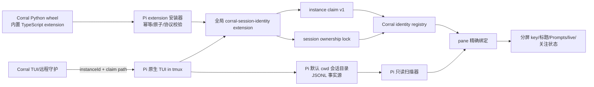
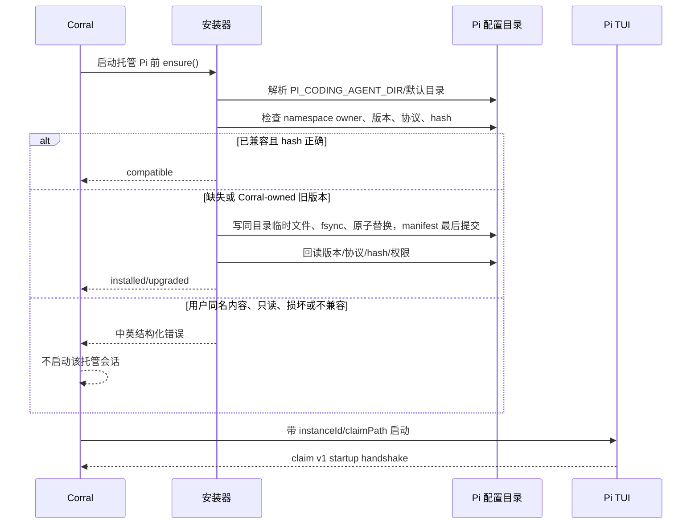
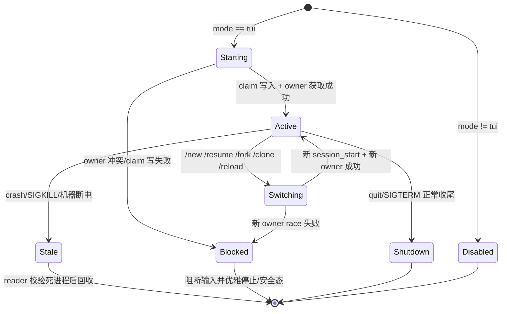
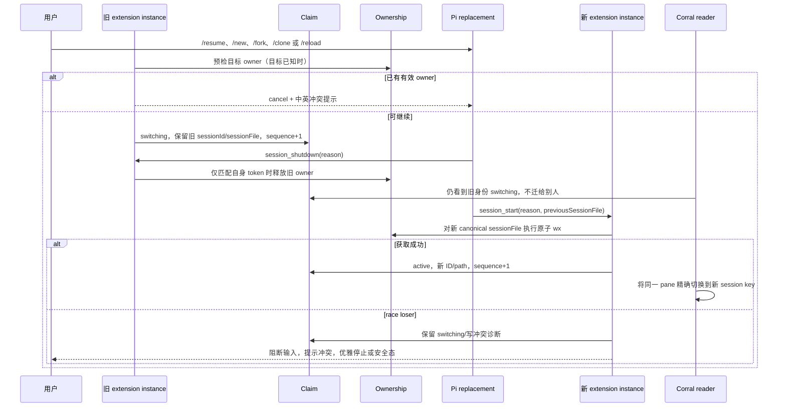
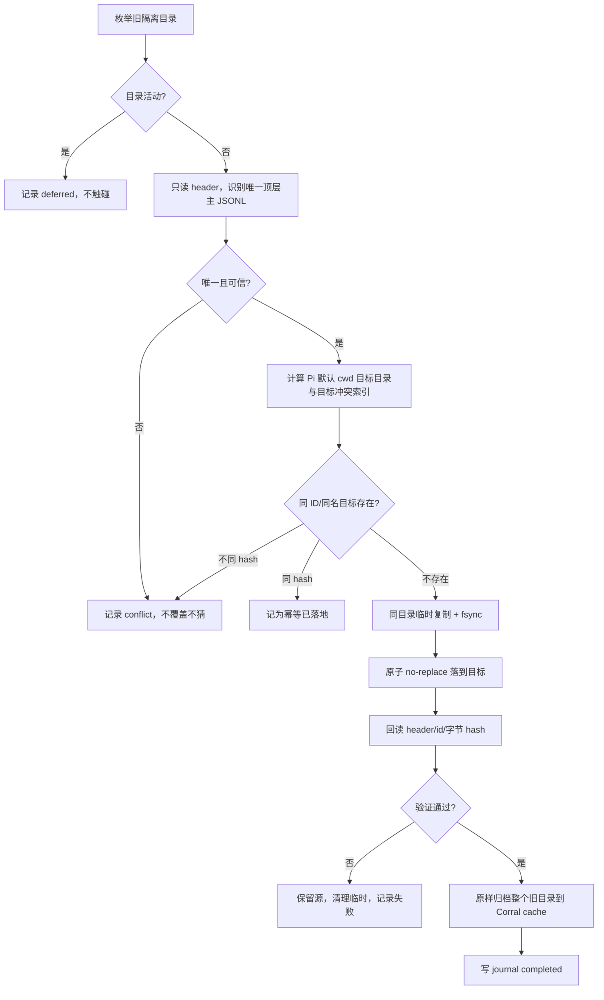

# Pi 会话身份扩展设计

> 状态：**设计已锁，进入实现前多维评审**  
> 裁定日期：2026-08-26  
> 适用范围：Corral 托管与观察到的 Pi 交互式 TUI 会话  
> 协议基线：claim protocol v1  
> 当前实现状态：v0.24.146 已落地自动安装、claim 精确绑定、默认目录、协作式单 writer 与旧历史 copy-through 迁移；日志轮转/诊断增强仍属后续。

本文是后续设计评审、实现拆片和验收的权威设计。已锁部分不是待选方案；标为“评审待验证假设”的条目必须先用 Pi 0.84.2 与本机 `pi-subagents` 实测，验证不成立时停止进入实现，不得靠 cwd、目录 mtime 或“最新会话”降级猜测。

## 1. 目标、非目标与不可破坏契约

### 1.1 目标

1. Corral 中的 Pi 无论新建、多分屏、切格、`/new`、`/resume`、`/fork`、`/clone`、subagent、重启或崩溃，pane 都不能绑定到错误会话。
2. Pi 原生 `/resume` 恢复默认的项目会话视图与 All 视图，能看到默认项目目录下全部顶层会话，不再被 Corral 的隔离小房间圈死。
3. 同一个 Pi 会话文件同一时刻最多一个协作式 writer；双开必须在用户输入或 assistant 消息落盘前被阻止。
4. 标题、Your prompts、live、关注圆点、分屏 key 全部以“运行时 + 精确会话 ID”归属；不确定时宁可显示“未关联/需重启”，绝不绑错。
5. Pi JSONL 始终是历史事实源。claim 与 ownership lock 只表达当前进程归属和写入租约，不承载正文，也不改写历史。

### 1.2 非目标

- 不修改或分叉 Pi 源码。
- 不替换 Pi 原生 TUI；Pi 继续运行在 tmux pane 中。
- 不采用 worktree 或 `--session-dir`/`PI_CODING_AGENT_SESSION_DIR` 会话隔离。
- 不把 Corral 变成 Pi 历史事实源，不伪造、不重写用户 JSONL。
- 短期不押注实验性的 Pi Server/SessionLease。
- 不把“提高扫描配额、递归补扫、过滤已知 subagent 文件名、取目录最新文件”当成身份修复。

### 1.3 三条硬契约

1. **明确身份优先，不猜测。** 有效 claim 是 Pi live 归属第一权威；没有有效 claim 就保持 provisional、静态预览或未关联。
2. **会话事实与进程事实分离。** JSONL 决定会话内容；claim 决定当前 TUI instance 正在展示哪条会话；ownership lock 决定谁能写该 JSONL。
3. **失败关闭在关联侧。** 插件安装、协议、claim、owner 任一不确定时，关闭的是“自动关联/继续写入”，不是改绑到另一条看似合理的会话。

## 2. 评审用例矩阵（实现前先逐项评审）

下表是下一阶段评审的最低全集。评审可以增加用例，不得删除或用较弱用例替代。

### 2.1 并发、项目与首次落盘

| 编号 | 场景 | 预期结果 | 关键证据 |
|---|---|---|---|
| C01 | 同 cwd 同时新建 1 个 Pi，首条回复前无 JSONL | pane 保持该 instance 的 provisional；文件出现后只按 claim 的 ID/path 转正 | claim active；分屏 key 迁移 0 或 1 次 |
| C02 | 同 cwd 同时新建 2 个 Pi，首条回复前都无 JSONL | 两格分别保持自己的 instance，不互认，不借用同项目旧会话 | 两个稳定 instanceId、两个独立 claim |
| C03 | 同 cwd 同时新建 4 个 Pi，快速连续切格 | 画面、标题、Your prompts、关注圆点始终与格子一致 | claim→pane 一对一；无重复 keepalive_name |
| C04 | 同 cwd 空文件持续数分钟后才首次落盘 | provisional 不超时抢别人；落盘后精确转正 | claim 仍 fresh；目标 ID 一致 |
| C05 | 两个项目同名、cwd 不同 | 不因项目名相同串会话 | canonical cwd 与精确 sessionFile |
| C06 | 同一项目路径在 macOS/Linux/Windows 表示不同 | 本机 canonical path 稳定；不同机器互不共享 claim/lock | 平台路径规范化测试 |
| C07 | 快速新建后立刻切走、再切回 | 原 pane 身份不因当前选中变化而改变 | instanceId 与 pane 名稳定 |

### 2.2 Pi 原生会话操作

| 编号 | 场景 | 预期结果 | 关键证据 |
|---|---|---|---|
| S01 | `/new` | 旧 claim 先 switching 并保留旧身份；新 `session_start` 覆盖 active | sequence 单调递增 |
| S02 | `/resume` 当前项目会话 | 目标 owner 预检；成功后只绑定目标精确 ID/path | targetSessionFile 与新 claim |
| S03 | `/resume` 其它项目会话 | cwd、sessionFile、sessionId 同步切换；项目信任流程不破坏身份 | claim header/cwd 与 JSONL 一致 |
| S04 | `/resume` 选择器当前项目视图 | 看见默认项目目录全部顶层会话 | 无 `--session-dir` 注入 |
| S05 | `/resume` All 视图 | 不被任何 Corral instance 私有目录圈死 | Pi 默认 `listAll` 行为 |
| S06 | `/fork` | 新文件获取新 owner；旧文件 owner 释放；pane 切到新 ID | reason=fork |
| S07 | `/clone` | 与 fork 生命周期一致，位置语义不影响文件身份 | `session_before_fork` + reason=fork |
| S08 | `/reload` | 同一进程/instance/nonce 延续；claim switching 后回到同会话 active | instanceId/nonce 不变 |
| S09 | `/tree` | 只换 leaf，不换 session file、owner 或 pane key | 无 session replacement claim |
| S10 | 恢复不存在的 ID/path | 启动失败，不静默新建空会话 | `--session` 非零退出 |

### 2.3 subagent、扩展与模型行为

| 编号 | 场景 | 预期结果 | 关键证据 |
|---|---|---|---|
| A01 | Pi subagent 并行 1 个，主会话继续工作 | subagent 不写主 pane claim、不获取主会话 owner | subagent mode/extension 生命周期实测 |
| A02 | Pi subagent 并行 4 个 | 主 pane claim 始终只指顶层 TUI 当前会话 | claim 数量、mode、parentSession |
| A03 | Pi subagent 并行 20 个 | 无 claim 风暴、锁误抢、扫描列表污染；性能有界 | claim/owner 文件数与扫描耗时 |
| A04 | 顶层 TUI `/fork` 带 `parentSession` | 仍被视为用户顶层会话，不能仅因 parentSession 被过滤 | mode=tui + 当前 runtime instance |
| A05 | 其它全局 extensions 并存 | load 顺序不改变身份协议；同名命令/工具无冲突 | 多扩展组合测试 |
| A06 | `/reload` 载入其它扩展新版本 | Corral extension 的 process nonce 与 sequence 连续 | reload 前后 claim |
| A07 | 标题后台生成 | `--print` 不写 claim/owner，不产生可扫描用户会话 | mode=print |
| A08 | provider failover/模型切换 | 不换 session file，不换 owner，不迁 pane key | claim session identity 不变 |
| A09 | SDK、RPC、JSON、print 模式 | 不写 claim/ownership | `ctx.mode !== "tui"` |

### 2.4 进程、终端与机器生命周期

| 编号 | 场景 | 预期结果 | 关键证据 |
|---|---|---|---|
| P01 | Pi 正常 quit | 写 shutdown、释放 owner、清理 claim；pane 转静态历史 | reason=quit |
| P02 | SIGTERM | 尽力触发 shutdown；即使未触发也可按 pid/start/nonce 回收 | 进程与残留文件 |
| P03 | SIGKILL | 残留 claim/owner 不会被新进程误认；确认旧进程死亡后可回收 | stale reclaim |
| P04 | Pi crash | pane 不改绑别人；显示结束或需重启 | 无 mtime fallback |
| P05 | tmux detach/reattach | instance 与 claim 不变，重新连接同一 pane | tmux name/pid |
| P06 | Corral TUI 重启，Pi/tmux 仍在 | 新 Corral reader 从有效 claim 恢复精确 pane 归属 | claim 冷读 |
| P07 | Corral crash，Pi/tmux 仍在 | Pi 继续写 claim；新 Corral 不靠旧内存猜测 | claim heartbeat |
| P08 | 机器重启 | 旧 pid/claim/owner 全部判 stale；新进程不得命中旧 PID | processStartedAt + nonce |
| P09 | PID reuse | 相同 pid 但启动时间/nonce 不同，旧 claim 无效 | 三元校验 |
| P10 | claim 半写、损坏、未知字段 | 原子写应避免半写；读到损坏则未关联并报协议错误 | 破坏性 fixture |
| P11 | claim 过期、心跳暂停、系统睡眠 | 不迁到别人；短暂 stale 后等新心跳恢复，否则提示重启 | updatedAt TTL |

### 2.5 单 writer 与恢复竞争

| 编号 | 场景 | 预期结果 | 关键证据 |
|---|---|---|---|
| W01 | 同一会话双开 | 一个 writer 获锁；另一个在消息落盘前停止/回安全态 | `wx` 唯一成功 |
| W02 | 同时双击恢复同一会话 | race winner 唯一，loser 不写 user/assistant entry | session_start 二次原子获取 |
| W03 | 旧 writer 慢退出，新恢复已发起 | 新恢复预检取消或等待用户重试，不抢 live owner | owner 的进程 claim 有效 |
| W04 | native Pi 与 Corral 同时恢复 | 安装并启用插件时同一把协作锁生效 | canonical sessionFile hash 一致 |
| W05 | `/resume` 预检后到 `session_start` 间被别人抢锁 | 二次获取发现 race，loser 阻断输入并优雅退出 | 双阶段锁测试 |
| W06 | owner 文件损坏但对应进程仍活 | 保守视为冲突，不删除、不猜测 | 未关联/错误提示 |
| W07 | owner 残留且原进程已死 | 校验 claim/pid/start/nonce 后安全回收 | stale tombstone + `wx` |
| W08 | `command pi` 主动禁用/删除插件后双开 | 明确属于协作式锁边界；Corral 不宣称可阻止 | 诊断提示“插件未生效” |

### 2.6 安装、升级与路径

| 编号 | 场景 | 预期结果 | 关键证据 |
|---|---|---|---|
| I01 | 插件不存在 | 首次需要 Pi 前自动幂等安装，协议校验通过才启动 | manifest/hash |
| I02 | 插件旧版本、协议可升级 | 原子升级后启动；失败不运行托管 Pi | version/protocol |
| I03 | 插件协议不兼容 | 中英错误并阻止启动 | 明确错误码 |
| I04 | 安装目录只读 | 中英错误并阻止启动，不回落猜测 | 无半安装文件 |
| I05 | 用户已有同名目录/文件且无 Corral owner marker | 不覆盖，报冲突并阻止启动 | namespace ownership |
| I06 | `PI_CODING_AGENT_DIR` 改址 | 安装、claim、owner 全部落到改址后的本机根 | 路径断言 |
| I07 | 默认 `~/.pi/agent` | 安装到 `extensions/corral-session-identity/index.ts` | 自动发现 + `/reload` |
| I08 | 其它 Pi 全局配置/包并存 | 不改 `settings.json`，不走网络，不触碰其它 namespace | 文件差异快照 |
| I09 | package/wheel 安装 | wheel 含完整 TypeScript asset 与 manifest | wheel 内容检查 |
| I10 | pipx 安装与升级 | 实际 `corral` 所在环境能读取打包 asset 并升级插件 | pipx 真链路 |
| I11 | editable/source 安装 | 源码 asset 可发现，行为与 wheel 一致 | editable 真链路 |
| I12 | Corral 卸载后用户目录残留 | 残留自包含、无网络/正文/外部依赖；重装可识别升级；文档明确清理边界 | 卸载/重装测试 |

### 2.7 旧隔离历史迁移

| 编号 | 场景 | 预期结果 | 关键证据 |
|---|---|---|---|
| M01 | 空 `corral-*`/`pickup-*` 目录 | 记录为空并跳过，不造文件 | migration journal |
| M02 | 目录只有一个顶层主 JSONL | 安全复制到默认 cwd 目录，源目录原样保留作回滚备份 | header/id/hash |
| M03 | 主 JSONL + 1/4/20 个 subagent | 只把主会话落到默认目录；subagent 与源目录不动 | ident/header 对齐 |
| M04 | 多个重复 header id | 不覆盖、不猜；报告冲突 | conflict report |
| M05 | 目标已有同名文件 | 不覆盖；同 hash 视为幂等完成，不同 hash 报冲突 | no-replace |
| M06 | 目标已有同 ID 不同文件名 | 同 hash 幂等；不同 hash 冲突 | 目标 header 索引 |
| M07 | 复制中断 | 临时文件不参与扫描；下次按目标 hash 幂等续跑 | no-replace + hash |
| M08 | 旧目录仍有活动 Pi | 延后整个目录，不触碰任何文件 | pid/env/open-file 检测 |
| M09 | header id 与目录 ident 不一致 | 不按 mtime选主；无法唯一证明时报告待处理 | 安全优先 |
| M10 | 迁移后 Pi `/resume` | 当前项目与 All 可见迁移后的顶层主会话 | Pi 原生 picker |
| M11 | 回滚迁移 | 首版源目录从未删除；只需在确认目标未继续写入后删除目标副本 | journal + hash |

### 2.8 Corral 全链路与多机

| 编号 | 场景 | 预期结果 | 关键证据 |
|---|---|---|---|
| E01 | 分屏 key、标题、Your prompts、live、关注圆点 | 五者始终跟同一 session key | 端到端快照 |
| E02 | claim 指向尚未进入扫描窗口的 JSONL | pane 保持 provisional/connecting，不回落 cwd/mtime | claim target cache |
| E03 | claim 无效或互相冲突 | 显示未关联/需重启，不借用任何“最新”会话 | 冲突 fixture |
| E04 | 远程守护与 TUI 同时扫描 | 两者读同一份本机 claim registry；只读结果一致 | 并发 reader 测试 |
| E05 | Mac 与 suzhou 同一项目 | 各用各自 `~/.pi`/改址目录，claim/owner/迁移记录不跨机同步 | 两机路径核对 |
| E06 | 本机无 Corral TUI，仅 native Pi | 插件仍可产出裸 Pi claim 与协作锁，不读取正文 | 默认 claim 路径 |
| E07 | 任一不确定状态 | 宁可未关联，绝不把 pane、标题或 prompts 挂到别人 | 全矩阵负向断言 |

## 3. 总体架构



### 3.1 组件职责

1. **打包 asset**：wheel 内携带无需编译、无需 npm install 的 TypeScript extension 与 Corral manifest；不从网络下载插件。
2. **安装器**：首次真正需要启动 Pi 前运行。它只管理自己的 namespace，检查 owner marker、版本、协议、内容 hash 与权限，采用临时文件 + fsync + 原子替换，重复执行收敛到同一结果。
3. **Pi extension**：只在 `ctx.mode === "tui"` 时参与 identity claim 与 ownership；不注册模型工具、不读对话 entries、不发送网络请求、不记录正文。
4. **identity registry**：Corral 内统一读取、校验、去冲突 claim。TUI、远程守护和只读扫描消费同一套结果，不能各写一份判定逻辑。
5. **pane binder**：有效 claim 是 live 第一权威。它只接受 claim 中精确 session ID/path，不再执行 cwd/mtime newcomer 认领。
6. **migration runner**：一次性把非活动旧隔离历史的顶层主会话复制回 Pi 默认 cwd 目录；v1 copy-through 保留原目录不删除。
7. **ownership manager**：extension 内以 canonical session file path 的 hash 命名锁，保证协作式单 writer。

### 3.2 本地路径与 namespace

所有路径都以 Pi 实际配置根为基准：优先 `PI_CODING_AGENT_DIR`，否则 `~/.pi/agent`。

| 用途 | 路径 |
|---|---|
| 自动发现入口 | `<PI_DIR>/extensions/corral-session-identity/index.ts` |
| 安装 owner/版本清单 | `<PI_DIR>/extensions/corral-session-identity/corral-manifest.json` |
| 默认裸 Pi claims | `<PI_DIR>/corral-session-identity/claims/v1/<instanceId>.json` |
| ownership locks | `<PI_DIR>/corral-session-identity/owners/v1/<sha256>.lock` |
| stale lock 隔离 | `<PI_DIR>/corral-session-identity/owners/v1/stale/` |
| 迁移 journal/报告 | `~/.cache/corral/pi-migration/v1/`（仍是本机，不同步） |
| 迁移 journal | `~/.cache/corral/pi-migration-v1.json`；源目录原样保留 |

目录创建权限为 `0700`，claim/owner/manifest 为 `0600`。Windows 无 POSIX mode 时使用仅当前用户可访问的 ACL；不能验证用户独占权限时安装或写锁失败关闭。

Corral 托管进程注入：

- `CORRAL_PI_INSTANCE_ID`：pane 生命周期内稳定、与 session ID 解耦的随机 instance UUID。
- `CORRAL_PI_CLAIM_PATH`：该 pane 唯一 claim 文件的绝对路径。

托管 claim 路径固定由 Corral 生成为 `<PI_DIR>/corral-session-identity/claims/v1/<instanceId>.json` 并通过环境注入；extension 不自行改址。instance 跨 `/new`、`/resume`、`/fork`、`/clone`、`/reload` 保持不变；Pi 进程重启必须产生新 instance。裸 Pi 没有这两个变量时，extension 生成 `native-<uuid>`，并把 instanceId 与 instanceNonce 写回当前进程环境，使 extension reload 后仍使用同一值。

## 4. 自动安装与版本协议

### 4.1 安装流程



### 4.2 namespace 所有权

- 只有 `corral-manifest.json` 同时包含固定 owner `corral`、受支持 manifest 版本和匹配内容 hash 时，目录才是 Corral-owned。
- 同名目录/文件存在但 marker 缺失、损坏或 owner 不匹配：**禁止覆盖、禁止删除、禁止合并**。
- 升级先写 `index.ts.tmp-<nonce>` 与 manifest 临时文件，逐个 fsync；原子替换入口后以 manifest 最后提交。中断造成版本/hash 不一致时，下次 ensure 重新安装；在重新通过前不启动托管 Pi。
- 安装不修改 Pi `settings.json`，不调用 `pi install`，不依赖 npm/git/network。
- 每次 Corral 升级可重复 ensure；只有 extension 或协议版本变化才改文件。

### 4.3 协议兼容与启动门禁

manifest 至少声明 `extensionVersion`、`claimProtocolMin`、`claimProtocolMax`、`sha256`。Corral 与 extension 必须有重叠协议范围；v1 reader 不解释未来版本。

启动有两道门：

1. **静态门**：启动前安装路径、owner、权限、hash、协议全部通过。
2. **运行门**：Pi 启动后在限定时间内必须写出与注入 instanceId 匹配的 claim。超时或不兼容时，pane 显示中英错误并停止这条新托管 Pi；不得转入旧启发式绑定。

错误至少包含：错误码、中文说明、英文说明、实际路径、可执行修复动作；不得包含命令正文、提示词、token 或完整环境。

### 4.4 卸载残留边界

pip/pipx 卸载不会可靠执行用户目录清理钩子，因此不能假装自动删除已经安装的全局 extension。残留必须满足：自包含、无网络、无正文、无 Python 依赖、只写 Corral namespace，并且重装后可幂等升级。发布文档应提供删除整个 Corral-owned namespace 的明确维护动作；若 owner marker 不匹配则不得自动清理。残留 extension 仍执行协作式单-writer 保护，这是已知、可解释的全局行为，不得静默变成半失效代码。

## 5. Claim protocol v1

### 5.1 JSON Schema

下面是 claim v1 的规范 schema。未列入 `required` 的扩展字段必须向后兼容；reader 忽略未知字段，但拒绝未知 `protocolVersion`。

```json
{
  "$schema": "https://json-schema.org/draft/2020-12/schema",
  "$id": "https://corral.dev/schemas/pi-session-claim-v1.json",
  "title": "Corral Pi Session Identity Claim v1",
  "type": "object",
  "additionalProperties": true,
  "required": [
    "protocolVersion",
    "extensionVersion",
    "instanceId",
    "pid",
    "processStartedAt",
    "instanceNonce",
    "state",
    "sessionId",
    "sessionFile",
    "cwd",
    "parentSession",
    "reason",
    "updatedAt",
    "sequence"
  ],
  "properties": {
    "protocolVersion": { "const": 1 },
    "extensionVersion": { "type": "string", "minLength": 1 },
    "instanceId": { "type": "string", "minLength": 8, "maxLength": 128 },
    "pid": { "type": "integer", "minimum": 1 },
    "processStartedAt": { "type": "string", "format": "date-time" },
    "instanceNonce": { "type": "string", "minLength": 16, "maxLength": 128 },
    "state": { "enum": ["active", "switching", "shutdown"] },
    "sessionId": { "type": "string", "minLength": 1 },
    "sessionFile": { "type": ["string", "null"] },
    "cwd": { "type": "string", "minLength": 1 },
    "parentSession": { "type": ["string", "null"] },
    "reason": { "enum": ["startup", "reload", "new", "resume", "fork", "quit"] },
    "targetSessionFile": { "type": ["string", "null"] },
    "updatedAt": { "type": "string", "format": "date-time" },
    "sequence": { "type": "integer", "minimum": 0 }
  }
}
```

### 5.2 示例

```json
{
  "protocolVersion": 1,
  "extensionVersion": "1.0.0",
  "instanceId": "3f62d970-88e2-47f4-9060-98115d787d58",
  "pid": 42173,
  "processStartedAt": "2026-08-26T11:15:47.124Z",
  "instanceNonce": "70de1759cfa34c309b19b5a455275e1c",
  "state": "active",
  "sessionId": "01a06f32-41f2-7ac0-9ccf-b388b8b289e8",
  "sessionFile": "/Users/example/.pi/agent/sessions/--Users-example-Codes-Corral--/2026-08-26T11-19-26-000Z_01a06f32-41f2-7ac0-9ccf-b388b8b289e8.jsonl",
  "cwd": "/Users/example/Codes/Corral",
  "parentSession": null,
  "reason": "startup",
  "targetSessionFile": null,
  "updatedAt": "2026-08-26T11:19:26.015Z",
  "sequence": 1
}
```

### 5.3 写入规则

- 值只来自 `ctx.sessionManager.getSessionId()`、`getSessionFile()`、`getHeader()`、`getCwd()` 与进程事实；不读 messages、entries、工具调用或提示词。
- 每次先在同目录创建 `0600` 临时文件，写完整 JSON，flush+fsync，再原子替换 claim；目录首次创建为 `0700`。
- `sequence` 对同一 instance 严格单调递增，跨 extension reload 从现有 claim 安全续接；不能回到 0。
- `session_start` 写 active；`session_before_switch` 先写 switching；`session_shutdown` 根据 reason 释放 owner并写相应状态。`session_before_fork` 用于 owner 预检，真正身份仍由 shutdown/start 写入。
- active 期间用低频本地 heartbeat 更新 `updatedAt` 和 sequence，使 reader 能验证更新时间；不启动网络、watcher 或子进程。timer 只在 TUI `session_start` 后创建，`session_shutdown` 幂等清理。
- quit 写 shutdown、释放 owner并清理 claim。new/resume/fork/reload 不删除 claim，避免 replacement 窗口被别人认领；新 `session_start` 原子覆盖 active。

## 6. Extension 生命周期与会话替换状态机

### 6.1 状态机



### 6.2 replacement 时序



### 6.3 不短暂错绑的规则

- switching claim 保留最后一次明确 sessionId/sessionFile；`targetSessionFile` 只作诊断，不提前成为 pane 身份。
- reader 看到 switching 时维持原 pane key 与静态/连接中状态，禁止扫描同 cwd 最新文件替换。
- 只有更高 sequence、同 instanceId/nonce 的 active claim 才能切换 pane key。
- `/tree` 不产生 replacement，不改变 claim 的 sessionId/sessionFile/owner。
- claim 指向的 JSONL 尚未创建或尚未进入扫描窗口时，保存 exact target 为 provisional；文件出现并且 header id 与 claim sessionId 一致后才转正。

## 7. Claim 校验与 pane 绑定

### 7.1 Reader 校验顺序

1. 路径必须位于受管 claims namespace，或等于该 pane 注入的绝对 claim path；拒绝软链逃逸。
2. JSON 完整、protocol 支持、必填字段类型正确，文件权限属于当前用户。
3. managed pane 的 claim `instanceId` 必须精确等于启动时登记值；裸 Pi 使用 claim 自身 instanceId。
4. pid 存活，并且 OS 进程启动时间与 `processStartedAt` 在平台容差内一致；instanceNonce 与同 instance 的当前记录一致，阻断 PID reuse。
5. active/switching claim 的 `updatedAt` 必须在 heartbeat TTL 内。睡眠唤醒导致短暂 stale 时保留最后一次精确 pane key但撤销 live，等待新心跳；超时持续则提示重启，不改绑。
6. sessionFile 存在时 canonical path 必须与 claim 一致，首行 header id/cwd 必须与 claim 的 sessionId/cwd 一致；不存在时保留 provisional。
7. 同一 managed instance 出现多份有效 claim、同一 session 出现互相冲突的 active claim、claim 与有效 owner 不一致时，全部进入 conflict，不自行择新者。
8. state=shutdown 或进程已死的 claim 不提供 live 归属；确认 stale 后只清理 Corral-owned 文件。

### 7.2 权威级别

| 优先级 | 证据 | 用途 |
|---|---|---|
| 1 | 有效 claim + 一致 owner（若 sessionFile 已知） | Pi live 与 pane 的唯一正向归属 |
| 2 | claim exact target 尚未落盘 | provisional/connecting，保留 pane 身份 |
| 3 | 已存在的 pane→session 静态记忆 | 旧 Pi 无 claim 时只保留静态预览并提示重启 |
| 禁止 | cwd、目录 mtime、最新 JSONL、进程启动时间配对 | 不得用于 pane 归属或迁 key |

扫描器仍可递归只读列出历史，但扫描列表不反向决定 pane 属主。标题与 Your prompts 始终以 `session_key = pi:<header id>` 读取；mtime 只用于列表时间，不参与身份。

### 7.3 旧的运行中 Pi

升级时已经在跑、没有 claim 的 Pi 不会被自动迁到任何新发现会话：

- 保留 Corral 已知的原 pane/session key；不迁移 key。
- 右栏只给该已知会话的静态预览，不把无 claim 进程标成精确 live。
- 明确提示“重启此 Pi 会话以启用精确关联 / Restart this Pi session to enable exact association”。
- 进程结束后正常按历史会话处理。

## 8. Subagent 边界

不能仅用 JSONL header 的 `parentSession` 判断 subagent，因为顶层 TUI 的 `/fork`、`/clone` 同样会产生 parentSession。

主边界是：

1. `ctx.mode === "tui"`；
2. 当前 extension runtime 对应的 Pi TUI process instance；
3. managed 情况下 instanceId 与 pane 注入值一致；
4. ownership 只由该 instance 对当前 `ctx.sessionManager.getSessionFile()` 获取。

`ctx.mode !== "tui"` 的 SDK、RPC、JSON、print 与预期中的 subagent invocation 不写 claim、不抢 owner。扫描列表仍按 Pi 实际 header/lifecycle 识别并过滤或归并非用户顶层内部会话；这与 claim 写入是两道独立防线。

**评审待验证假设**：本机 `pi-subagents` 实际启动方式的 `ctx.mode`、是否加载全局 extensions、是否继承 `CORRAL_PI_INSTANCE_ID/CORRAL_PI_CLAIM_PATH`、subagent 是否产生独立 session_start/shutdown，必须现场记录。若 subagent 实际也是 `mode=tui` 或复用主 instance 环境，本设计不能直接进入实现，必须增加可验证的 runtime-role 信号；禁止改用 parentSession 或 mtime 猜测兜底。

## 9. 协作式 ownership lock

Pi 0.84.2 没有跨进程会话文件锁。Corral extension 使用本机协作式锁；主动禁用、删除或绕开插件的 Pi 不在保证范围内。

### 9.1 锁名与 canonical path

1. sessionFile 已存在：解析绝对路径、消除 `.`/`..` 与 symlink，使用平台 canonical case。
2. 尚未存在：规范化父目录真实路径 + 原始 basename；Windows 统一盘符和大小写规则。
3. 对 canonical UTF-8 path 计算 SHA-256，锁名为 `<hash>.lock`。
4. lock 内容保留 canonicalSessionFile，reader 必须复算 hash，防路径规范化分歧。

### 9.2 Lock v1 内容

```json
{
  "protocolVersion": 1,
  "canonicalSessionFile": "/Users/example/.pi/agent/sessions/--Users-example-project--/session.jsonl",
  "sessionPathHash": "a47f8f7c0e63b83db9b79b79f99e60f2844d39f6b953af33856c93222b44b972",
  "instanceId": "3f62d970-88e2-47f4-9060-98115d787d58",
  "pid": 42173,
  "processStartedAt": "2026-08-26T11:15:47.124Z",
  "instanceNonce": "70de1759cfa34c309b19b5a455275e1c",
  "claimPath": "/Users/example/.pi/agent/corral-session-identity/claims/v1/3f62d970.json",
  "ownershipToken": "0040666106a746a8b3a872f0344eb7fe",
  "acquiredAt": "2026-08-26T11:19:26.010Z",
  "updatedAt": "2026-08-26T11:19:26.010Z"
}
```

### 9.3 获取、预检、释放与回收

- 原子获取用 exclusive create（Node `wx` 语义），一次写完整内容、fsync 后关闭；只有一个 contender 成功。
- `/resume` 的 `session_before_switch` 对已知目标预检，发现有效 owner 时 `{cancel: true}` 并提示；`session_before_fork` 同样执行可做的预检。
- `session_start` 必须再次对实际 `getSessionFile()` 原子获取，关闭“预检后被抢”的竞态。
- 在 ownership 状态不是 held 时，extension 的 `input` handler 阻断用户输入；race loser 在任何 user/assistant entry 落盘前提示并 `ctx.shutdown()`，或进入经过验证的只读安全态。
- `session_shutdown` 仅在 lock 内容的 instanceId、nonce、ownershipToken 都匹配自己时释放，禁止误删后来者 owner。
- stale 回收先验证 pid 已死，或 pid 启动时间/nonce 与 claim 不一致；随后把旧 lock 原子移入 `stale/`，再重新执行 `wx`。两个回收者并发时仍只有一个能得到最终 lock。
- owner 文件半写/损坏且对应 pid 可能仍活时保守冲突；不得删除。
- lock heartbeat 可与 claim heartbeat 同步更新 `updatedAt`，但更新只能在 token 仍匹配时进行。

### 9.4 待验证的写入门槛

必须证明 Pi 的 `session_start` 与 extension `input` 拦截发生在首条 user/assistant entry 持久化之前。允许 Pi 在此之前创建 header-only 文件，但 race loser 不能追加任何对话 entry。若事件顺序不满足，协作锁无法达到目标，评审必须退回寻找更早的官方 hook，不得宣称“基本不会撞”。

## 10. 旧隔离历史一次性迁移

> **v0.24.146 实现裁定**：首版采用比原设计更保守的 copy-through。目标仍以 no-replace + 完整 hash 校验原子创建，但验证后不删除、不移动源目录；原件就是回滚备份。这样已经让 Pi 原生 `/resume` 看见主会话，同时把跨文件系统归档/恢复的破坏面降为零。下文“归档后删除源”的流程仅保留为未来可选收尾，不是当前行为。

### 10.1 范围与识别

- 来源只包括 Pi sessions 树下旧 `corral-*`、`pickup-*` 隔离目录。
- 扫描阶段继续只读兼容这些历史，直到迁移完成并归档。
- 活动目录整目录延后：进程环境仍指向该 session-dir、进程打开其中 JSONL、或有效旧 pane 仍关联时都算活动。
- 主候选优先且原则上要求：header id 与目录 ident 精确一致、JSONL 首行有效、不是已证明的内部 subagent。
- `parentSession` 不能单独判内部；目录 ident 对齐是主证据。无法唯一证明顶层主会话时报告冲突，不按 mtime 选一个。

### 10.2 迁移流程



具体约束：

1. 目标目录按 Pi 默认 cwd 编码生成，不传自定义 session-dir。
2. 复制保持源 JSONL 字节不变；不改 header、文件内路径、ID、时间戳或 parentSession。
3. 临时文件必须与目标同文件系统；完成 copy、flush、fsync 后，用不覆盖既有目标的原子落地。可使用同目录 hard-link/no-replace 原语；平台不支持时迁移失败，不退化成可能覆盖的 rename。
4. 目标冲突同时按最终文件名和 header ID 检查。相同完整 hash 视为幂等；不同内容一律报告。
5. 目标回读验证通过后，整个旧目录（含未迁入默认目录的 subagent 文件）原样归档到 cache，并写包含 source、destination、hash、archive、阶段的 journal。跨文件系统归档必须 copy+fsync+hash 验证后才移除来源。
6. 每一阶段先落 journal 再进入下一阶段；中断后按磁盘事实续跑，不凭上次内存状态。
7. 完成后 Pi `/resume` 应从默认项目目录看见顶层主会话；Corral 扫描不得再把 archive 当历史入口。

### 10.3 回滚

- 回滚前确认原旧目录与迁移目标都没有有效 owner/活动 writer。
- 只删除“journal 记录为本次创建且当前 hash 未变化”的目标；内容已变化时停止并报告，绝不删除用户后续写入。
- 从 archive 原样恢复整个旧目录，采用同样的 no-replace、fsync 与 hash 验证。
- 回滚不重写 JSONL；冲突时保留目标和 archive，交由人工决策。

## 11. 日志与隐私

### 11.1 身份事件

只记录低基数事实：事件名、runtime=`pi`、instance/session/claim/owner 的短前缀、state、reason、protocolVersion、sequence、耗时、错误码。禁止记录：正文、提示词、messages、argv、command、token、完整环境、完整 session path。

建议事件：`pi_extension_ensure`、`pi_claim_seen`、`pi_claim_invalid`、`pi_claim_transition`、`pi_owner_acquire`、`pi_owner_conflict`、`pi_owner_reclaim`、`pi_pane_bind`、`pi_pane_unbound`、`pi_migration_item`。

### 11.2 有界轮转

当前超过 256KB 整文件清空会永久丢证据，必须在身份改造同期替换：

- 当前段达到上限后原子轮转，至少保留上一段；目标采用 current + 3 个 256KB archive，固定总上限。
- 轮转失败只降级日志，不阻断 claim/owner/pane 主流程。
- 并发 writer 必须使用进程内串行和跨进程安全的轮转策略，避免两次 rename 互相覆盖。
- `corral diagnose` 能报告当前段、归档段、最近 identity 错误，但仍只读。

## 12. 失败矩阵

| 失败 | 检测 | 用户行为 | 自动恢复 | 禁止行为 |
|---|---|---|---|---|
| 插件缺失/旧版 | ensure manifest/hash | 安装或升级后启动 | 可 | 静默用旧扫描猜测 |
| 安装只读/同名冲突 | 写权限/owner marker | 中英错误，不启动 | 修复权限/移开冲突后重试 | 覆盖用户文件 |
| extension 未加载 | 启动 handshake 超时 | 停止新托管 Pi，提示检查全局扩展 | 重装后重试 | 把同 cwd 最新会话绑上 |
| claim 协议未知 | protocolVersion | 未关联/需升级 | 升级兼容版本 | 猜字段含义 |
| claim 损坏/半写 | JSON/schema | 未关联，保留原 pane 静态身份 | 下一次原子写可恢复 | 读取半份字段 |
| claim 过期 | heartbeat TTL | 撤销 live，保留精确静态 key并提示 | 新 heartbeat 恢复 | 迁到别人 |
| claim 指向文件未落盘 | exact ID/path | connecting/provisional | 文件出现后转正 | 回落 mtime |
| claim 与 header 不一致 | 首行 id/cwd | conflict/需重启 | 正确 claim 到来 | 任选一方 |
| 同 instance 多 claim | registry 冲突 | 未关联 | 清理 stale 后恢复 | 取 updatedAt 最新者 |
| owner 被占 | 有效 lock+claim | 预检取消或 race loser 停止 | 旧 owner 退出后重试 | 双 writer |
| owner stale | pid/start/nonce | 短暂连接中 | 安全隔离旧锁后重获 | 只按 pid 判 stale |
| owner 损坏且进程可能活 | 无法验证 | 冲突提示 | 人工确认/进程退出后回收 | 删除锁 |
| Pi crash/SIGKILL | pid 消失 | pane 结束/静态预览 | stale cleanup | 绑定别的会话 |
| 旧运行 Pi 无 claim | registry 无记录 | 静态预览并提示重启 | 重启后启用 | 自动迁移 pane |
| 迁移目标冲突 | 文件名/id/hash | 报告并跳过该目录 | 相同 hash 幂等 | 覆盖或重命名掩盖冲突 |
| 迁移中断 | journal+磁盘事实 | 下次续跑 | 可 | 重复复制不同内容 |
| 日志轮转失败 | I/O 错误 | 主功能继续 | 后续写重试 | 清空全部旧证据 |

## 13. 评审待验证假设

以下不是已证实事实，不得在评审时被“设计看起来合理”替代：

1. Pi 0.84.2 中 `session_start`、`session_before_switch`、`session_before_fork`、`session_shutdown` 的实际顺序与官方文档一致，cancel 在 `/new`、`/resume`、`/fork`、`/clone` 均能阻止 replacement。
2. `ctx.sessionManager.getSessionId/getSessionFile/getHeader/getCwd` 在每种 reason 下都已切到文档声明的当前/目标会话；尤其首次空文件与其它项目 `/resume`。
3. `session_start` + `input` gate 足够早，race loser 不会落盘 user/assistant entry。
4. `ctx.mode !== "tui"` 能排除本机 `pi-subagents`、SDK/RPC/print/json；subagent 的全局 extension 生命周期和环境继承符合 §8。
5. process 环境内保存的 instanceId/instanceNonce 能跨 `/reload` 与 extension rebind 保持，旧 extension 闭包不会在 reload 后继续写 claim。
6. Pi 退出信号在 SIGTERM 下触发 `session_shutdown`；SIGKILL 只依赖 stale 回收。
7. getSessionFile 的路径 canonical 化在 macOS 大小写文件系统、Linux、Windows 与 Pi 自身打开路径一致。
8. 多个全局 extension 并存、provider failover、project trust 切换不会跳过或重入身份事件。
9. heartbeat timer 在 session replacement/reload 后不会重复存活。
10. 本机 Pi 默认 cwd 目录编码与 Corral 迁移目标生成规则一致；迁移后 `/resume` 当前项目与 All 均可见。

任一假设失败时，评审输出必须包含：实际事件序列、失败用例、需要调整的契约层；不得先实现再用兼容启发式掩盖。

## 14. 验收门禁

### 14.1 设计评审门

- §2 每一行都有明确自动化或真机证据方案。
- §13 十项假设在 Pi 0.84.2 和本机 `pi-subagents` 上完成记录。
- claim schema、owner schema、路径 canonical 规则、TTL/heartbeat 参数完成安全与跨平台评审。
- 明确确认不再创建新的 `corral-*`/`pickup-*` session-dir。

### 14.2 自动化门

1. TypeScript extension 事件状态机、原子 claim、heartbeat、reload sequence、mode gate。
2. installer 的缺失/升级/只读/同名冲突/改址/hash/中断恢复。
3. reader 的 schema、权限、PID reuse、nonce、TTL、损坏、冲突、provisional。
4. ownership 的双开、预检竞态、race loser input gate、stale reclaim、token-safe release。
5. pane/store/split/title/prompts/attention 全链路只按 session key 迁移。
6. migration 的 §2.7 全矩阵与 rollback。
7. 日志 current+archives 轮转与脱敏。
8. 安装产物测试：source、editable、wheel、pipx、升级、卸载残留、重装。
9. 跨平台：macOS、Linux、Windows 路径与原子文件原语。

### 14.3 真实链路门

- 同 cwd 真开 1/2/4 个 Pi，在首条回复前、首条落盘后、快速切格三个阶段分别核对 pane key、标题、Your prompts、live、圆点。
- 在顶层 Pi 真跑 `pi-subagents` 1/4/20 并继续主会话工作；检查 claim/owner、扫描列表与画面。
- 真跑 `/new`、当前/其它项目 `/resume`、`/fork`、`/clone`、`/reload`、`/tree`。
- 真制造双恢复、旧 writer 慢退、SIGTERM/SIGKILL、tmux/Corral/机器重启和 PID reuse fixture。
- 真迁移一份隔离历史备份，使用 Pi 原生 `/resume` 当前项目与 All 视图验收，再执行回滚。
- Mac 与 suzhou 分别验收各自配置根；禁止通过 Syncthing 或远程守护同步 claim/owner。
- 真实 wheel 与 pipx 安装后从实际 `corral` 命令启动，不能只在源码解释器里验证。

**发布阻断条件**：任何一次把 pane、标题或 Your prompts 绑定到错误会话；任何双 writer 写入；`/resume` All 被圈死；安装失败后静默降级；迁移覆盖或改写用户 JSONL；任一支持语言显示文案键名。

## 15. 分阶段实施切片与文件影响范围

下列是评审通过后的预期影响范围，不代表本文已经修改这些文件。实现时每一片独立通过对应门禁后再进入下一片；不得用一笔大改同时替换全部证据链。

### Slice 0：事件探针与假设验证

- 新增仅测试用 Pi extension fixture，记录事件名、reason、mode、session id/file/cwd、extension reload 生命周期，不记录正文。
- 覆盖 §13，特别是 `pi-subagents` 与首条输入前锁门槛。
- 预期文件：`tests/` Pi 集成夹具、测试脚本与本设计的验证结果附录；不进入发布功能路径。

### Slice 1：打包 asset 与自动安装（v0.24.146 已完成）

- 新增 wheel 内置 TypeScript extension asset 与 manifest。
- 新增 Pi extension installer/compatibility checker；接入所有 Corral 托管 Pi 启动入口。
- 补齐中英安装/协议错误。
- 预期文件：`src/corral/` 下新的 Pi identity/installer 模块与 extension asset、`runtime/pi.py`、托管启动接线、`i18n.py`、`pyproject.toml`、wheel/pipx 安装测试。

### Slice 2：claim writer、reader 与精确 pane 绑定（v0.24.146 已完成）

- extension 实现 lifecycle claim/heartbeat/mode gate。
- Python 侧新增统一 identity registry；Pi 扫描/live 注解、provisional reconcile、pane key 迁移改为 claim-first。
- 删除新启动路径中的 `--session-dir` 与 `PI_CODING_AGENT_SESSION_DIR` 注入，只保留新建 `--session-id`、恢复 `--session <id|path>`。
- 预期文件：extension asset、`runtime/pi.py`、`scan/pi.py`、`store.py`、`liveness.py`、`keepalive.py`/托管环境注入、分屏与侧栏消费层、对应扫描/UI/分屏测试。

### Slice 3：单 writer ownership（v0.24.146 已完成）

- extension 增加 canonical path、`wx` owner、switch/fork 预检、session_start 二次获取、input gate、token-safe release、stale reclaim。
- Corral reader 联合校验 claim+owner，诊断冲突。
- 预期文件：extension asset、identity registry、Pi 运行时启动错误处理、i18n、ownership/双开/信号集成测试。

### Slice 4：旧历史迁移（v0.24.146 已完成 copy-through）

- 新增只读发现、活动目录延后、copy+fsync+no-replace、归档 journal、报告、幂等与 rollback。
- 扫描器在迁移期继续只读旧隔离历史；完成后不再生成隔离目录。
- 预期文件：新的 Pi migration 模块、Pi 扫描兼容入口、诊断/维护入口、i18n、迁移 fixture 与真实备份冒烟。

### Slice 5：日志轮转、诊断与收口（待后续）

- 把 256KB 整文件清空替换为有界轮转，至少保留上一段；加入低基数 identity 事件。
- `diagnose` 展示 extension/claim/owner/migration/轮转状态，不读取正文。
- 删除旧 Pi live map、session-dir newcomer 与 cwd/mtime pane 绑定路径；扫同根因残留。
- 同步 `SESSION_SCANNING_KNOWLEDGE_BASE.md`、`MAINTAINER_GUIDE.md`、`OBSERVABILITY_KNOWLEDGE_BASE.md`、隐私与安装文档。
- 预期文件：`observe.py`、`agent_api.py`、Pi 扫描/运行时旧兼容代码、相关测试与上述文档。

## 16. 未来演进

Pi Server/SessionLease 稳定并提供可依赖的会话身份与写入租约后，可以替换 claim/owner 的 transport，但以下契约不得改变：

- pane 只按明确会话身份绑定；
- 一个 session 同一时刻最多一个 writer；
- 不确定时未关联，不猜测；
- Pi 历史仍是事实源；
- `/resume` 使用 Pi 默认会话世界；
- 标题、Your prompts、live、关注圆点始终跟 session key。

## 17. 依据与关联文档

- [会话扫描与对话内容领域知识库 §2.2.1](../SESSION_SCANNING_KNOWLEDGE_BASE.md)：扫描如何**消费** claim、列表配额与 `keep_ids`；协议不在那边定义。
- [维护指南“Pi 扫描与启动” / “会话保活与存活判定”](../MAINTAINER_GUIDE.md)：Pi JSONL 格式、启动参数、无害告警；保活启动包装 vs 存活判定拆分。
- [可观测知识库](../OBSERVABILITY_KNOWLEDGE_BASE.md)：日志脱敏和 256KB 整文件清空的取证缺陷。
- Pi 官方 `extensions.md`：Session Events、ExtensionContext、mode 与 replacement 生命周期。
- Pi 官方 `session-format.md`、`sessions.md`：JSONL header、parentSession、tree、默认会话目录与 SessionManager。
- Pi 官方 `packages.md`：全局 extension/package 的安装与 scope；Corral 采用 wheel 自带、本地原子安装，不调用网络包安装。
- Pi 官方 `environment-variables.md`：`PI_CODING_AGENT_DIR` 与待删除的 `PI_CODING_AGENT_SESSION_DIR` 语义。

## 18. 与会话扫描的边界

改「谁正在用哪一条会话」读本文；改「有哪些历史、正文是什么、列表会不会被旧目录挤爆」读扫描知识库。两边不要互相补对方的启发式。

| 在这边 | 不在这边 |
|---|---|
| claim 协议、插件安装/升级、所有权锁、旧隔离搬家、pane 精确绑定 | 列出 JSONL/SQLite、对话预览、签名缓存、`limit` / `keep_ids` |
| 禁止 cwd / mtime /「目录最新文件」当身份 | 旧隔离目录仍单独占一份扫描配额（迁移期列表完整性，不是身份策略） |
| 一个会话同一时刻最多一个 writer | 一个 `keepalive_name` 只能挂一条会话（存活判定的闸，见维护指南） |
| Codex 包装器回执与 threadId claim（附录） | Codex 正文去重、`thread_source=subagent` 过滤、macOS 合并 `lsof` |

扫描器可以把 claim 读成 live 标志，但**不得**用扫描结果反向决定 pane 属主，也不得在扫描里复活已废弃的每会话小房间。

## 附录：Codex 托管身份

不要再以历史扫描作为新托管会话的身份来源。Corral 启动时生成不可预测的宿主 nonce，并将 nonce、目标 tmux 名和一次性私有 claim 路径传给启动包装器；包装器已在 Codex TUI 与 `codex app-server` 的双向 JSON-RPC 通道上，必须从 `thread/start` 返回值或 `thread/started` 通知取得完整 `threadId` 后，以原子方式写入 `{nonce, threadId, rolloutPath, pid}`。Corral 只接受 nonce 精确相同、路径在 Codex 会话根内、threadId/rolloutPath 一致且 pane 仍存活的单一 claim，然后用真实 threadId 取代占位卡；`/new`、`/resume`、`/fork` 发生时同样以 app-server 生命周期事件更新 claim。缺 claim、重复 claim、路径不一致或子线程声明时，一律停在占位/未托管态并记录诊断，绝不回落到 cwd、mtime、短 id 或祖先链猜测。

历史扫描只保留给外部/旧会话发现和崩溃恢复。短托管标识不是 Codex 原生会话 ID；包装器还可能在同一祖先链内拉起多层 `codex` 进程。验收必须包括同 cwd 三个并行托管窗口、会话内新建/恢复/分叉、包装器重连与 Corral 重启；每个窗口的真实 threadId、首条任务和实时终端必须一一对应。实现入口：`codex_identity.py`。